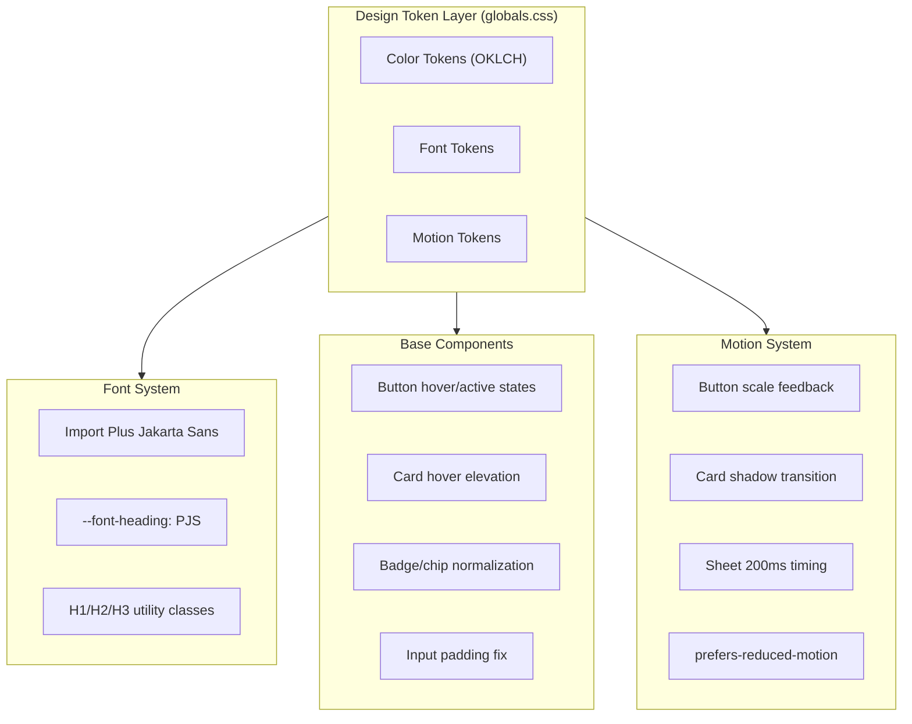
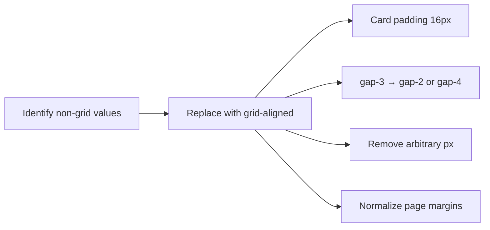
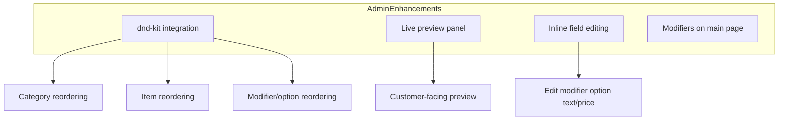

# Design — Design System Hard Cutover

## Overview

Full app-wide overhaul of CravingsPH to align every component, screen, and page with the authoritative Design System document. Executed in three phases:

- **Phase 1 (Foundation):** Design tokens, typography, component polish, motion
- **Phase 2 (Normalization):** 8px spacing grid enforcement across all files
- **Phase 3 (Admin Overhaul):** Drag-and-drop, live preview, inline editing

This document covers all three phases as a standalone reference.

### Design Vision

CravingsPH should feel **warm, appetizing, and effortless** — like a friend recommending their favorite local spot. The aesthetic is mobile-first with generous whitespace, warm orange accents that evoke appetite and energy, and a clean hierarchy that lets food photography and restaurant identity take center stage.

**Brand personality:** Friendly, local, trustworthy, appetizing. Not corporate, not generic, not clinical.

**Visual identity keys:**
- Warm orange (#F86006) used strategically — CTAs, highlights, active states — never overwhelming
- Peach gradients for retention pages (Orders, Saved, Account) create a welcoming "home" feeling
- Pill shapes on customer portal for approachability
- Plus Jakarta Sans headings: modern, friendly, strong on mobile (confirmed by UI/UX Pro Max as "friendly modern SaaS" font)
- Inter body: neutral, readable workhorse — acceptable despite being common because it's the Design System's explicit choice paired with a distinctive heading font
- Card-based discovery with shadow depth cues

**The test:** CravingsPH should look like it was designed by a Filipino food-loving team, not generated by AI. The warm orange + peach + pill shape combination is intentional brand identity, not a random palette.

---

## Detailed Requirements

### From Idea Honing

1. **Phasing:** Three sequential phases — Foundation → Spacing → Admin
2. **Typography:** Plus Jakarta Sans replaces League Spartan for all headings
3. **Accent token:** Follows spec exactly — orange (same as primary), with component opacity adjustments
4. **Source of truth:** Design System document is authoritative
5. **Scope:** Every component, screen, and page — customer-facing, admin, and shared

### From Design System Document

**Colors:**
- Primary (Cravings Orange): oklch(0.66 0.23 40) — #F86006
- Dark text: #1D1D1D → oklch(0.18 0.02 260)
- Neutrals: Background #FFFFFF, Light Gray #F7F7F7, Divider #EAEAEA, Secondary Text #6B6B6B

**Typography:**
- Headlines: Plus Jakarta Sans — H1 32px SemiBold, H2 24px SemiBold, H3 20px Medium
- Body: Inter — Body Large 16px, Body 14px, Caption 12px
- Line height: 1.5–1.6 for body text

**Spacing:** 8px grid — 4/8/16/24/32/48/64px scale

**Motion:** 150–250ms duration, ease-out curves, scale feedback on buttons (1.02–1.04 hover, 0.98 active), shadow elevation on card hover

**Components:** Primary buttons (bg primary, white text, 12px 16px padding, rounded-md), secondary buttons (transparent + border), restaurant cards (4:3 image, 16px padding, shadow-sm → shadow-md hover), menu item cards (1:1 image, 2-line clamp, price emphasized), inputs (12px padding, rounded-md, focus primary border), cuisine chips (muted bg, 6px 10px padding, rounded-xl)

### From Web Interface Guidelines

- Honor `prefers-reduced-motion` for all new animations
- Animate only `transform`/`opacity` (compositor-friendly) — never `transition: all`
- Icon buttons need `aria-label`
- `font-variant-numeric: tabular-nums` for number columns
- `text-wrap: balance` on headings
- Visible `focus-visible:ring-*` on all interactive elements
- `touch-action: manipulation` for mobile tap responsiveness
- Critical fonts: `<link rel="preload">` with `font-display: swap`

---

## Architecture Overview

### Phase 1: Foundation



### Phase 2: Spacing Normalization



### Phase 3: Admin Overhaul



---

## Components and Interfaces

### Phase 1 Changes

#### 1. Design Tokens (`src/app/globals.css`)

Update all `:root` token values to match the Design System spec:

```css
:root {
  /* ── Core tokens (Design System spec) ── */
  --background: oklch(1 0 0);
  --foreground: oklch(0.18 0.02 260);

  --card: oklch(1 0 0);
  --card-foreground: oklch(0.18 0.02 260);

  --popover: oklch(1 0 0);
  --popover-foreground: oklch(0.18 0.02 260);

  /* Cravings Orange */
  --primary: oklch(0.66 0.23 40);
  --primary-foreground: oklch(1 0 0);

  --secondary: oklch(0.97 0.01 260);
  --secondary-foreground: oklch(0.18 0.02 260);

  --muted: oklch(0.96 0.01 260);
  --muted-foreground: oklch(0.45 0.02 260);

  /* Accent = Primary (per spec) */
  --accent: oklch(0.66 0.23 40);
  --accent-foreground: oklch(1 0 0);

  --border: oklch(0.92 0.01 260);
  --input: oklch(0.92 0.01 260);
  --ring: oklch(0.66 0.23 40);
}
```

**Accent impact mitigation:** Since `--accent` becomes orange, components using `hover:bg-accent` (ghost buttons, dropdown items, sidebar items) will show orange. Mitigate by updating those hover patterns to use `hover:bg-accent/10` or `hover:bg-primary/5` instead of `hover:bg-accent` for subtle warm tinting rather than full orange surfaces.

**Keep existing project-specific tokens:** `--destructive`, `--success`, `--warning`, `--peach`, `--sidebar-*`, `--chart-*` remain unchanged.

#### 2. Font System (`src/lib/fonts.ts`, `src/app/globals.css`, `src/app/layout.tsx`)

**fonts.ts changes:**
- Remove League Spartan import
- Add Plus Jakarta Sans import (Google Fonts, weights: 500, 600, 700)
- Keep Inter, Antonio, Geist Mono

**globals.css changes:**
- `--font-heading: var(--font-plus-jakarta-sans)` (new)
- `--font-display: var(--font-plus-jakarta-sans)` (was League Spartan)
- Keep `--font-sans: var(--font-inter)`
- Keep `--font-display-alt: var(--font-antonio)`
- Keep `--font-mono: var(--font-geist-mono)`
- Add heading scale utilities:
  ```css
  @utility font-heading {
    font-family: var(--font-heading);
  }

  /* Semantic heading scale */
  @utility text-h1 {
    font-size: 2rem; /* 32px */
    line-height: 1.2;
    font-weight: 600;
  }
  @utility text-h2 {
    font-size: 1.5rem; /* 24px */
    line-height: 1.3;
    font-weight: 600;
  }
  @utility text-h3 {
    font-size: 1.25rem; /* 20px */
    line-height: 1.4;
    font-weight: 500;
  }
  ```
- Add `text-wrap: balance` to heading utilities
- Add `font-variant-numeric: tabular-nums` utility for number displays

**layout.tsx changes:**
- Apply Plus Jakarta Sans CSS variable to `<html>`
- Add `<link rel="preload">` for Plus Jakarta Sans with `font-display: swap`

**CLAUDE.md update:**
- Change "League Spartan (display/headings)" to "Plus Jakarta Sans (headings)"

**Critique finding — font identity shift:** League Spartan is condensed and high-impact. Plus Jakarta Sans is soft, rounded, friendly geometric. This is a significant brand personality change. The first implementation step should render key screens (hero, restaurant header, orders page) with Plus Jakarta Sans and visually confirm that:
1. Heading hierarchy is clear against Inter body text (both are geometric sans — risk of blurring)
2. H1 at 32px SemiBold has sufficient visual weight
3. The "friendly, modern SaaS" personality (confirmed by UI/UX Pro Max) matches CravingsPH's food/discovery context

#### 3. Button Component (`src/components/ui/button.tsx`)

Add hover brightness and active scale:

```typescript
// Base interactive states (added to all variants)
const interactiveBase = "transition-[background-color,transform,box-shadow] duration-200 ease-out active:scale-[0.98] cursor-pointer"

// Variant changes:
// default (primary): add "hover:brightness-110" instead of "hover:bg-primary/90"
// secondary (admin/default shape): "bg-transparent border border-primary text-primary hover:bg-primary/5"
// secondary (customer/pill shape): keep "bg-secondary text-secondary-foreground hover:bg-secondary/80"
```

**Critique finding — secondary button dual behavior:** The customer portal uses pill-shaped secondary buttons as soft CTAs (Orders, Saved, Account pages). Making them all bordered-transparent would change visual weight. Solution: secondary variant behavior depends on `shape`:
- `shape="default"` (admin): transparent + border (Design System spec)
- `shape="pill"` (customer): keep solid subtle background (brand convention per CLAUDE.md)

Motion must honor `prefers-reduced-motion`:
```css
@media (prefers-reduced-motion: reduce) {
  /* Scale transforms disabled, only color changes */
}
```

Animate only `transform` and `opacity` — compositor-friendly per Web Interface Guidelines.

**UI/UX Pro Max checklist:**
- `cursor-pointer` on all clickable elements
- Hover transitions 150-300ms (using 200ms)
- Touch targets minimum 44x44px (h-9 = 36px is below — ensure icon buttons use `size-10` or `size-11`)

#### 4. Card Hover Elevation

Add to base Card component or via a composable wrapper:

```typescript
// Restaurant card: add hover shadow elevation
"transition-[box-shadow,transform] duration-200 ease-out hover:shadow-md"

// Optional click feedback:
"active:scale-[0.98]"
```

Restaurant card specific: ensure `rounded-lg` (radius-lg per spec).

#### 5. Restaurant Card Image Ratio

**Critique finding:** Changing from h-32 (~128px) to true 4:3 would nearly double image height on a 300px card (~225px), breaking visual density and contradicting the "Quick Scan" Design System principle.

**Decision: Context-dependent aspect ratio:**
- **Vertical grid** (home page, search results): `aspect-[3/2]` (compromise — more generous than 2.3:1 but preserves card density and scannability)
- **Horizontal scroll** (featured sections): Keep compact `h-32` for fast scanning
- **Full-width hero cards** (if added later): True `aspect-[4/3]`

```typescript
// Vertical grid cards:
// Replace: h-32 w-full
// With: aspect-[3/2] w-full object-cover

// Horizontal scroll cards (keep compact):
// Keep: h-32 w-full
```

Images need explicit `width` and `height` attributes per Web Interface Guidelines to prevent CLS.

**Visual QA:** Compare cards above-the-fold at 375px viewport with both ratios before committing.

#### 6. Badge/Chip Normalization

Create a `chip` variant on Badge for cuisine/filter tags:

```typescript
// New "chip" variant for cuisine tags
chip: "bg-muted text-muted-foreground rounded-xl px-2.5 py-1.5"
// padding: ~6px 10px equivalent (py-1.5 = 6px, px-2.5 = 10px)
```

Keep `rounded-full` for pill-shaped badges in the customer portal (per CLAUDE.md: "Customer portal uses pill shapes").

#### 7. Input Padding Fix

Update input component padding from `px-3 py-1` to match spec's 12px:

```typescript
// Replace: px-3 py-1 h-9
// With: px-3 py-2.5 (12px vertical padding, ~44px total height)
// Or keep h-9 and center with flex if height constraint needed
```

#### 8. Sheet/Dialog Timing

Reduce sheet animation duration from 300/500ms to spec range:

```typescript
// Sheet open: 500ms → 250ms (critique: 200ms may feel abrupt for bottom sheets on mobile)
// Sheet close: 300ms → 200ms
// Easing: ease-in-out → ease-out
```

**Critique finding:** Test at 250ms for open, 200ms for close. Bottom sheets need slightly more time to feel natural on mobile — the asymmetry (slower open, faster close) matches user expectation.

#### 9. Accent Hover Migration

Since `--accent` becomes orange, update all ghost/subtle hover patterns:

**Components to update:**
- `button.tsx` ghost variant: `hover:bg-accent` → `hover:bg-primary/5`
- `button.tsx` outline variant: `hover:bg-accent` → `hover:bg-primary/5`
- `dropdown-menu.tsx` items: `focus:bg-accent` → `focus:bg-primary/5`
- `sidebar.tsx` menu items: `hover:bg-sidebar-accent` → keep (sidebar has own token)
- `navigation-menu.tsx`: `hover:bg-accent` → `hover:bg-primary/5`
- `select.tsx` items: `focus:bg-accent` → `focus:bg-primary/5`
- `command.tsx` items: `aria-selected:bg-accent` → `aria-selected:bg-primary/5`
- `tabs.tsx` active: `bg-accent` → review if orange is appropriate here

Each component must be checked — some may benefit from warm orange accent (active tab indicator), while hover backgrounds should be subtle.

#### 10. Touch Target Audit (UI/UX Pro Max)

Per UI/UX Pro Max guidelines: minimum 44x44px touch targets, minimum 8px gap between targets.

**Current issues:**
- Default button `h-9` (36px) — below 44px minimum on mobile
- Icon buttons `size-9` (36px) — below minimum
- Badge/chip taps may have insufficient spacing

**Fix strategy:** Don't change the base component sizes (would be too disruptive). Instead:
- Ensure mobile-primary CTAs use `size="lg"` (h-10 = 40px) or larger
- Add `touch-action: manipulation` to interactive containers to eliminate 300ms tap delay
- Verify 8px minimum gap between adjacent touch targets (gap-2 minimum)
- Bottom nav items already use adequate sizing — verify with `min-h-[44px]`

#### 11. Hardcoded Value Cleanup

- `globals.css`: Replace `#f86006` with `oklch(0.66 0.23 40)` for `--primary`
- `qr-code-preview.tsx`: Replace hardcoded hex in print popup with token references
- All `text-[10px]` → `text-xs` (12px, matches Design System caption)

#### 11. Motion Additions

**Button scale feedback (all interactive buttons):**
```css
/* Applied via button.tsx base styles */
transition: background-color 200ms ease-out, transform 200ms ease-out;
```
```css
/* hover: subtle scale */
&:hover { transform: scale(1.02); }
/* active: press feedback */
&:active { transform: scale(0.98); }
```

**Card hover elevation (restaurant cards, menu cards):**
```css
transition: box-shadow 200ms ease-out, transform 200ms ease-out;
&:hover { box-shadow: var(--shadow-md); }
```

**Reduced motion support:**
```css
@media (prefers-reduced-motion: reduce) {
  * { transition-duration: 0.01ms !important; }
}
```

---

### Phase 2 Changes

#### Spacing Grid Enforcement

**Strategy:** Systematic find-and-replace across all files, converting non-8px-grid values to the nearest grid value.

**Conversion rules:**
| Non-grid value | Grid replacement | Rationale |
|---------------|-----------------|-----------|
| gap-3 (12px) | gap-2 (8px) or gap-4 (16px) | Context-dependent: tight → gap-2, standard → gap-4 |
| gap-1.5 (6px) | gap-1 (4px) or gap-2 (8px) | Micro → gap-1, small → gap-2 |
| p-3 (12px) | p-2 (8px) or p-4 (16px) | Cards → p-4, compact elements → p-2 |
| p-5 (20px) | p-4 (16px) or p-6 (24px) | Standard → p-4, sections → p-6 |
| py-3 (12px) | py-2 (8px) or py-4 (16px) | Context-dependent |
| px-3 (12px) | px-2 (8px) or px-4 (16px) | Context-dependent |
| space-y-3 (12px) | space-y-2 (8px) or space-y-4 (16px) | Context-dependent |

**Card padding normalization:**
- shadcn Card defaults: `py-6 px-6` (24px) → `py-4 px-4` (16px) per spec
- Affects CardHeader, CardContent, CardFooter padding

**Arbitrary value removal:**
- `text-[10px]` → `text-xs` (already covered in Phase 1)
- `w-[260px]` → responsive width (e.g., `w-64` = 256px or remove fixed width)
- `[3px]`, `[10px]` padding → nearest grid value

**Page margin consistency:**
- Mobile: `px-4` (16px) — standard everywhere
- Desktop: `md:px-6` (24px) or `md:px-8` (32px) — consistent per page type

**Max-width:**
- Content pages: `max-w-5xl` (1024px) — close to spec's 1200px
- Or add custom `max-w-content` token at 1200px

---

### Phase 3 Changes

> **Critique note:** Phase 3 is the highest-effort phase and is intentionally kept at a high level here. It requires a **separate detailed PDD session** before implementation to address: cross-category drag behavior, preview rendering for items without images, inline editing + form validation interaction, optimistic reorder rollback UX, and mobile touch drag thresholds. The spec below provides architectural direction, not implementation-ready detail.

#### 1. Drag-and-Drop Integration

**Library:** `@dnd-kit/core` + `@dnd-kit/sortable`

**Reorderable entities:**
- Menu categories (horizontal tab order)
- Menu items within a category (grid reorder)
- Modifier groups within an item
- Options within a modifier group
- Variant entries

**UI pattern per Web Interface Guidelines:**
- During drag: disable text selection, `inert` on dragged element
- Drag handle icon (GripVertical from Lucide)
- Visual feedback: dragged item elevated with shadow, drop target highlighted
- Touch: `touch-action: manipulation` on drag handles

**Backend:** Add `sortOrder` / `position` column to relevant tables (categories, items, modifiers, options). New tRPC mutations for batch reorder.

#### 2. Live Preview Panel

**Location:** Side panel in menu item edit flow (replaces current modal-only editing or adds split view).

**Structure:**
```
┌─────────────────────────────────────┐
│  Edit Form (left/main)  │  Preview  │
│  ─────────────────────  │  ───────  │
│  Name: [________]       │  [Image]  │
│  Description: [____]    │  Name     │
│  Price: [___]           │  Desc     │
│  Image: [upload]        │  ₱Price   │
│  Modifiers: [expand]    │  Mods...  │
└─────────────────────────────────────┘
```

**Preview component:** Renders the menu item exactly as the customer-facing `MenuItemCard` would, using the same component with live form values via React Hook Form's `watch()`.

#### 3. Inline Editing for Modifier Options

Replace current delete-and-recreate pattern:
- Click option name → inline text input
- Click option price → inline number input
- Blur or Enter → save via mutation
- Escape → cancel

#### 4. Modifiers on Main Page

Move modifier group management from nested dialog to collapsible sections on the menu item edit page:
- Each modifier group is an expandable `<Collapsible>` section
- Groups can be reordered via drag handles
- Options within each group are reorderable
- "Add group" button at the bottom
- No more nested dialog-inside-dialog pattern

---

## Data Models

### Phase 1 & 2: No database changes
All changes are CSS, component, and layout level.

### Phase 3: Database additions

```sql
-- Add sort order columns
ALTER TABLE categories ADD COLUMN sort_order integer NOT NULL DEFAULT 0;
ALTER TABLE menu_items ADD COLUMN sort_order integer NOT NULL DEFAULT 0;
ALTER TABLE modifier_groups ADD COLUMN sort_order integer NOT NULL DEFAULT 0;
ALTER TABLE modifier_options ADD COLUMN sort_order integer NOT NULL DEFAULT 0;
ALTER TABLE variants ADD COLUMN sort_order integer NOT NULL DEFAULT 0;
```

New tRPC mutations:
- `category.reorder` — batch update sort_order
- `menuItem.reorder` — batch update sort_order within category
- `modifierGroup.reorder` — batch update sort_order within item
- `modifierOption.reorder` — batch update sort_order within group
- `modifierOption.update` — update name/price (currently missing)

---

## Error Handling

### Phase 1
- If Plus Jakarta Sans fails to load: `font-display: swap` ensures text renders with fallback (Inter/system). No broken UI.
- Token changes are CSS-only — no runtime errors possible.
- Motion changes: `prefers-reduced-motion` media query ensures accessibility.

### Phase 2
- Spacing changes are visual-only. No runtime errors.
- Risk: layout shifts if padding changes are too aggressive. Mitigate with visual review per page.

### Phase 3
- Drag-and-drop: optimistic reorder with rollback on mutation failure. Toast error notification.
- Inline edit: validation errors shown inline. Network failure → toast with retry.
- Preview panel: if form values are invalid, preview shows last valid state.
- Destructive actions (delete modifier/option): confirmation dialog per Web Interface Guidelines ("Destructive actions need confirmation modal or undo window").

---

## Visual QA Gates (Critique Requirement)

Each phase ends with a mandatory visual review before the next phase begins. This prevents cascading regressions.

### Phase 1 → Phase 2 Gate
1. Screenshot every major page at 375px and 1024px: Home, Restaurant Detail, Search, Orders, Saved, Account, Login, Admin Dashboard, Menu Management
2. Compare before/after for: font rendering (PJS headings), token color changes (accent orange in ghost hovers), button hover/active states
3. **Specific checks:**
   - Plus Jakarta Sans headings create enough contrast against Inter body text (they're both geometric sans — verify hierarchy is clear)
   - Ghost button hovers at `bg-primary/5` feel warm but not garish
   - Active scale(0.98) doesn't cause layout shifts on buttons inside flex containers
4. Do NOT start Phase 2 until screenshots are reviewed

### Phase 2 → Phase 3 Gate
1. Screenshot every major page again at 375px and 1024px
2. Overlay 8px grid on 3 representative pages to verify alignment
3. **Specific checks:**
   - Card padding change (24px → 16px) doesn't make content feel cramped
   - gap-3 → gap-2/gap-4 conversions look natural (no gaps that are too tight or too wide)
   - No broken layouts, no horizontal overflow on mobile
4. Do NOT start Phase 3 until screenshots are reviewed

### Phase 3 Gate (Before Merge)
1. Full E2E test of drag-and-drop flows (mouse + touch)
2. Preview panel renders accurately across item types
3. Modifier inline editing handles validation edge cases

---

## Testing Strategy

### Phase 1: Foundation

**Unit tests:**
- Button component: verify hover class, active scale class, transition properties
- Card component: verify hover shadow elevation class
- Badge chip variant: verify correct padding and radius
- Token values: snapshot test of globals.css token values against spec

**Visual tests:**
- Each base component (button, card, input, badge) rendered in Storybook or test page
- Typography scale: h1/h2/h3 rendered with Plus Jakarta Sans
- Verify `prefers-reduced-motion` disables scale/transform animations

**Integration tests:**
- Font loading: Plus Jakarta Sans renders for headings, Inter for body
- Token cascade: accent color correctly applied as orange throughout

### Phase 2: Spacing

**Visual regression:**
- Screenshot comparison of all major pages before/after spacing changes
- Key pages: Home, Restaurant Detail, Orders, Saved, Account, Search, Admin Dashboard, Menu Management

**Manual review:**
- 8px grid overlay check on representative pages
- Card padding consistency (16px everywhere)
- Page margin consistency (16px mobile, 24-32px desktop)

### Phase 3: Admin

**Unit tests:**
- Drag-and-drop: item reorder updates sort_order correctly
- Inline edit: text/price update calls correct mutation
- Preview: renders with current form values

**Integration tests:**
- Full reorder flow: drag item → drop → verify new order persists
- Modifier editing: add group → add option → edit option → reorder → save
- Preview updates live as form fields change

**E2E tests:**
- Menu management: create category → add item → edit modifiers → reorder → verify customer view
- Drag-and-drop across touch and mouse interactions

---

## Acceptance Criteria

### Phase 1

- AC1: All `:root` tokens in globals.css match the Design System spec values exactly
- AC2: Plus Jakarta Sans renders for all heading text (`font-heading` class)
- AC3: Heading scale utilities (`text-h1`, `text-h2`, `text-h3`) produce correct sizes/weights
- AC4: Buttons show brightness hover and scale(0.98) active state
- AC5: Secondary button has transparent background with primary border
- AC6: Restaurant cards use 4:3 aspect ratio images
- AC7: Cards show shadow-md elevation on hover
- AC8: All `text-[10px]` replaced with `text-xs`
- AC9: No hardcoded hex values remain (except Google brand colors)
- AC10: Sheet animations complete within 200ms with ease-out curve
- AC11: `prefers-reduced-motion` disables all scale/transform animations
- AC12: Ghost/outline button hovers use `bg-primary/5` (warm subtle tint, not full orange)
- AC13: Focus states use `focus-visible:ring-*` (not outline-none without replacement)
- AC14: `font-variant-numeric: tabular-nums` applied to stat/number displays

### Phase 2

- AC15: Zero non-8px-grid spacing values in the codebase (no 12px, 20px, 6px gaps)
- AC16: Card padding is 16px (p-4) across all card instances
- AC17: Page margins are 16px mobile, 24-32px desktop consistently
- AC18: No arbitrary pixel values remain (no `[3px]`, `[10px]`, `[13px]`)
- AC19: All pages visually consistent with no broken layouts

### Phase 3

- AC20: Categories, items, modifiers, and options are reorderable via drag-and-drop
- AC21: Drag handles visible on all reorderable items
- AC22: Live preview panel shows menu item as customer sees it, updating in real time
- AC23: Modifier options are editable inline (name and price)
- AC24: Modifier groups appear as collapsible sections on the edit page (not nested modal)
- AC25: `sort_order` columns exist and are used for all orderable entities
- AC26: Reorder changes persist across page reload

---

## Appendices

### A. Technology Choices

| Choice | Rationale |
|--------|-----------|
| Plus Jakarta Sans (Google Fonts) | Design System spec. Modern, friendly, strong mobile readability. Free. |
| `@dnd-kit/core` + `@dnd-kit/sortable` | Best React DnD library. Accessible, performant, supports touch. ~15kb. |
| CSS-only animations (no Framer Motion) | Matches existing approach. Lighter bundle. Compositor-friendly transforms. |
| Tailwind `@utility` for heading scale | Tailwind v4 native. No plugin needed. Consistent with codebase patterns. |

### B. Research Findings Summary

| Area | Compliance Before | Key Gaps |
|------|------------------|----------|
| Typography | 30% | Plus Jakarta Sans missing, font-heading undefined, no heading scale |
| Colors/Tokens | 40% | accent/ring wrong, primary in hex, foreground achromatic |
| Spacing | 65% | 200+ non-grid values, card padding too large |
| Components | 55% | Restaurant card ratio wrong, no hover states, badge inconsistent |
| Motion | 40% | No scale feedback, sheets too slow, no page transitions |
| Admin | 45% | No DnD, no preview, no inline editing |

### C. Alternative Approaches Considered

1. **Keep League Spartan** — rejected per user decision; Design System doc is authoritative
2. **Accent as warm neutral** — rejected; follow spec exactly with opacity mitigation
3. **Framer Motion for animations** — rejected; CSS-only is lighter and matches existing approach
4. **Incremental token migration** — rejected; tokens are a single-file change, do it all at once
5. **react-beautiful-dnd** — rejected; deprecated in favor of @hello-pangea/dnd or dnd-kit; dnd-kit is more modern and accessible
6. **Separate admin color temperature** — considered (critique: "Notion/Linear/Stripe are cool/neutral, warm peach may fight"). Deferred to Phase 3 PDD session. The sidebar already has its own `--sidebar-*` tokens which can be independently tuned. For Phase 1, admin shares the same tokens as customer portal.
7. **4:3 image ratio everywhere** — rejected per critique; would break visual density on mobile. Using 3:2 for grid cards, keeping h-32 for horizontal scroll.

### C2. UI/UX Pro Max Recommendations Applied

| Recommendation | Applied? | Where |
|---------------|----------|-------|
| Vibrant & block-based style | Partially — warm orange + peach is vibrant; block layout already in place | Overall aesthetic |
| cursor-pointer on all clickable | Yes | Button base styles (Phase 1) |
| Touch targets 44px minimum | Addressed — audit + size-lg for mobile CTAs | Phase 1, section 10 |
| touch-action: manipulation | Yes | Interactive containers |
| 150-300ms transitions | Yes — using 200ms standard | Motion system |
| prefers-reduced-motion | Yes | Global media query |
| Skeleton loaders | Already implemented | No change needed |
| cursor-pointer on hoverable cards | Yes | Restaurant card, menu item card |
| 8px gap between touch targets | Enforced via Phase 2 spacing | Phase 2 |
| inputmode for mobile keyboards | Existing — verify during Phase 2 | Forms audit |

### D. Files Affected

#### Phase 1 (Foundation) — ~30 files

**Create:**
- None (all changes to existing files)

**Modify:**
| File | Changes |
|------|---------|
| `src/app/globals.css` | All token values, heading scale utilities, motion utilities |
| `src/lib/fonts.ts` | Replace League Spartan with Plus Jakarta Sans |
| `src/app/layout.tsx` | Font variable application, preload link |
| `src/components/ui/button.tsx` | Hover brightness, active scale, secondary variant, transition properties |
| `src/components/ui/card.tsx` | Hover shadow elevation |
| `src/components/ui/badge.tsx` | Add chip variant |
| `src/components/ui/input.tsx` | Padding adjustment |
| `src/components/ui/sheet.tsx` | Animation duration/easing |
| `src/components/ui/dialog.tsx` | Animation duration/easing |
| `src/components/ui/dropdown-menu.tsx` | Accent hover → primary/5 |
| `src/components/ui/select.tsx` | Accent hover → primary/5 |
| `src/components/ui/command.tsx` | Accent hover → primary/5 |
| `src/components/ui/navigation-menu.tsx` | Accent hover → primary/5 |
| `src/components/ui/tabs.tsx` | Review accent usage |
| `src/components/ui/sidebar.tsx` | Review accent usage |
| `src/features/discovery/components/restaurant-card.tsx` | Image aspect ratio, hover shadow |
| `src/features/branch-settings/components/qr-code-preview.tsx` | Remove hardcoded hex |
| `src/components/layout/customer-bottom-nav.tsx` | text-[10px] → text-xs |
| `CLAUDE.md` | Update font reference |
| All 22 files using `font-heading` | Verify class now works (no changes needed if utility defined) |

#### Phase 2 (Spacing) — ~100+ files

Systematic spacing value replacements across `src/app/`, `src/features/`, `src/components/`.

#### Phase 3 (Admin) — ~15-20 files

**Create:**
| File | Purpose |
|------|---------|
| `src/features/menu-management/components/sortable-menu-item.tsx` | Draggable menu item wrapper |
| `src/features/menu-management/components/sortable-category-tab.tsx` | Draggable category tab |
| `src/features/menu-management/components/menu-item-preview.tsx` | Customer-facing preview panel |
| `src/features/menu-management/components/inline-edit-field.tsx` | Reusable inline edit component |
| `src/features/menu-management/components/modifier-section.tsx` | On-page collapsible modifier groups |

**Modify:**
| File | Changes |
|------|---------|
| Menu management page | Add DnD context, sortable wrappers |
| `modifier-group-dialog.tsx` | Refactor to on-page collapsible sections |
| `edit-item-dialog.tsx` | Add preview panel, restructure layout |
| `menu-item-card.tsx` | Add drag handle |
| DB schema files | Add sort_order columns |
| tRPC routers | Add reorder/update mutations |

### E. Web Interface Guidelines Compliance Checklist

Applied to all Phase 1 component changes:

- [ ] Icon buttons have `aria-label`
- [ ] Animations honor `prefers-reduced-motion`
- [ ] Only `transform`/`opacity` animated (compositor-friendly)
- [ ] No `transition: all` — properties listed explicitly
- [ ] Visible `focus-visible:ring-*` on interactive elements
- [ ] `touch-action: manipulation` on mobile-interactive elements
- [ ] `font-variant-numeric: tabular-nums` on number displays
- [ ] `text-wrap: balance` on headings
- [ ] Critical font preloaded with `font-display: swap`
- [ ] Images have explicit width/height
- [ ] Destructive actions have confirmation
