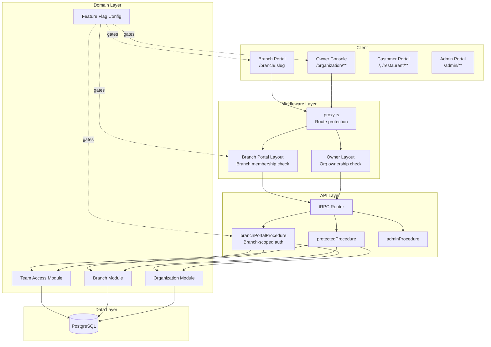
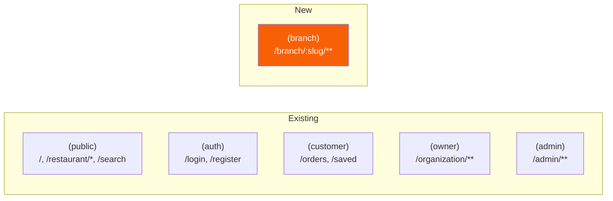
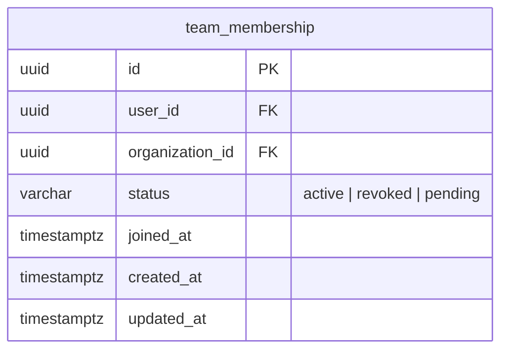
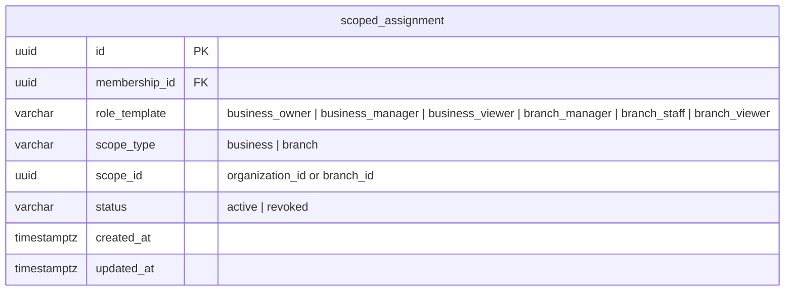
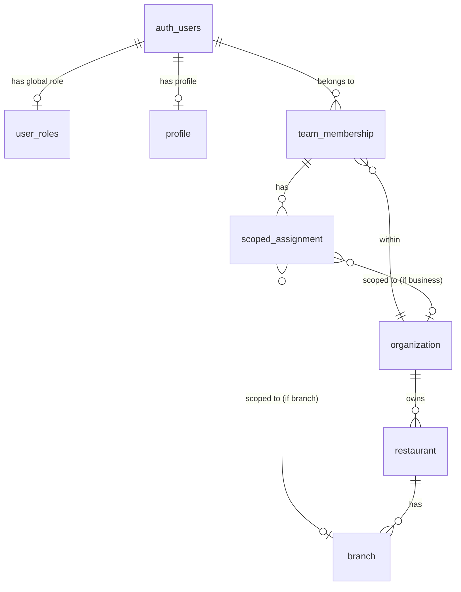
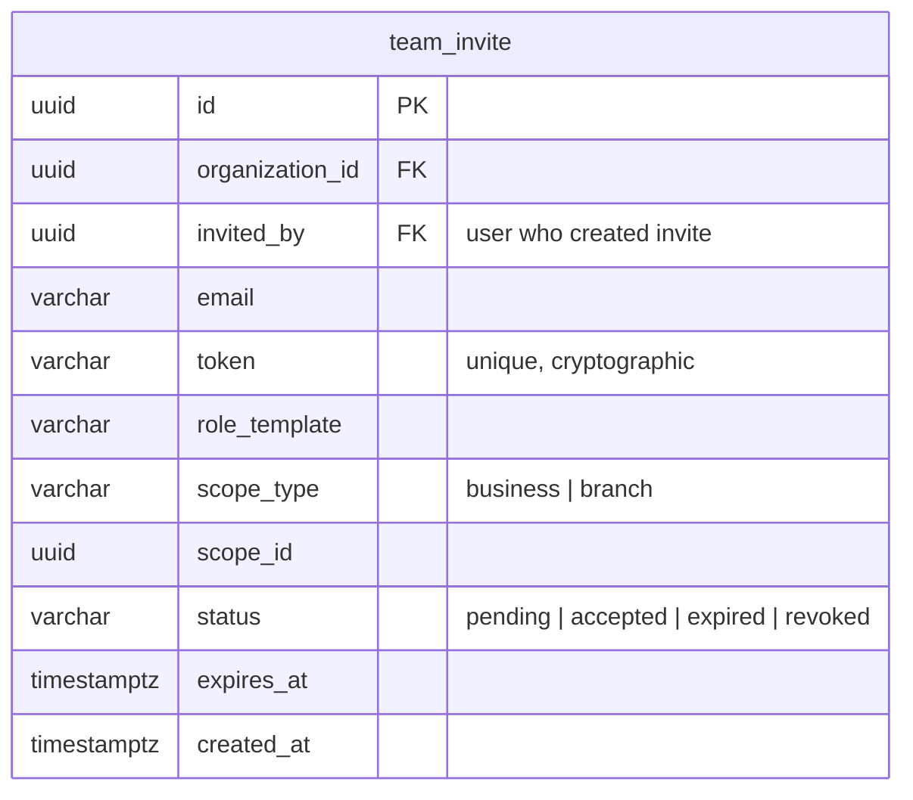
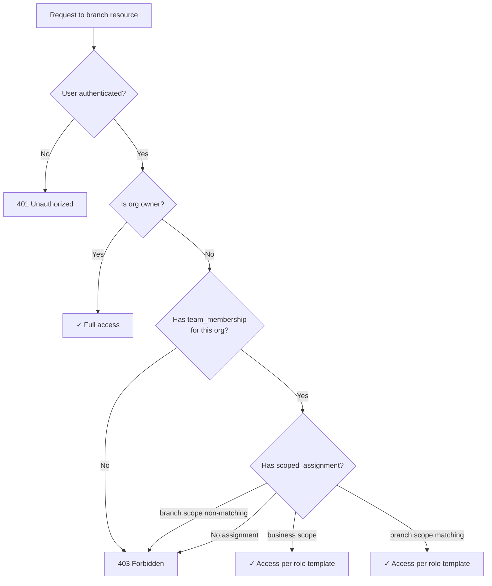
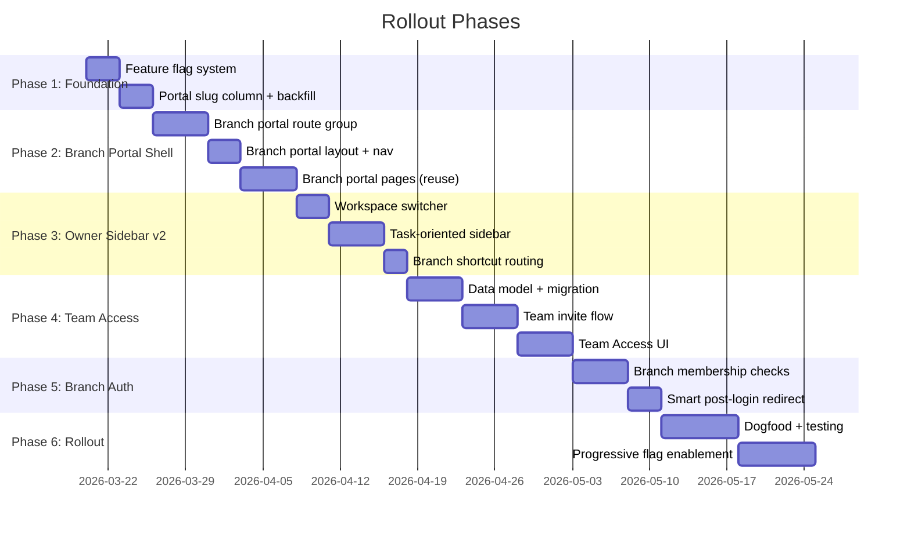

# Detailed Design: Branch Ops Portal + Owner Console IA + Team Scope

## Overview

This design introduces two interconnected changes to the CravingsPH platform:

1. **Branch Ops Portal** — A branch-scoped workspace at `/branch/:slug` for daily operations (orders, menu, tables, settings), giving branch staff a short, memorable entry point without navigating deep owner console hierarchies.

2. **Owner Console IA + Team Scope** — A restructured owner sidebar using task-oriented groups and a workspace switcher, plus a team access foundation with membership and scoped role assignments.

Both changes ship behind feature flags for controlled rollout. The existing owner org console is preserved as the higher-level multi-restaurant management surface.

---

## Detailed Requirements

### Branch Ops Portal

1. **Branch-scoped workspace** — Users with branch access land in a workspace scoped to a single branch. Navigation is limited to branch operations (Overview, Orders, Menu, Tables, Settings).
2. **Readable branch URL** — Branch portal uses `/branch/:portalSlug` where `portalSlug` is a globally-unique, human-readable slug in the format `<restaurant-slug>-<branch-slug>`.
3. **Smart post-login landing** — Users with exactly one branch land directly in that branch portal. Users with multiple branches see a branch picker.
4. **Branch membership model** — Users can be assigned to specific branches with branch-scoped roles (`branch_manager`, `branch_staff`, `branch_viewer`).
5. **Branch-scoped authorization** — Branch portal routes and mutations enforce branch-level access. A user assigned only to Branch A cannot access Branch B.
6. **Owner console preserved** — The org console remains the higher-level control surface. Branch portal does not replace owner-wide controls.
7. **Feature-flag gated** — Branch portal routing, staff access, and short routes each behind independent flags.

### Owner Console IA

1. **Task-oriented sidebar** — Replace nested restaurant→branch tree with flat groups: Overview, Restaurants, Branch Operations, Team Access, Account.
2. **Stable sidebar** — Sidebar does not grow as restaurants/branches are added. Discovery happens in list/detail pages.
3. **Workspace switcher** — Sidebar header contains a context switcher for selecting a restaurant. Branch shortcuts within the selected restaurant context route to `/branch/:portalSlug`.
4. **Branch shortcut destinations** — Owner console branch shortcuts route into readable branch portal URLs.

### Team Access

1. **Role template + scope** — Access assignments combine a role template (`business_owner`, `business_manager`, `branch_staff`, etc.) with a scope (`business` or `branch`) and a scope target ID.
2. **Membership + scoped assignments** — A membership layer answers "is this user part of the business?" while scoped assignments answer "what can they do, and where?"
3. **Simplified user-facing hierarchy** — Users see Platform → Business → Branch. Internal model preserves Platform → Organization → Restaurant → Branch.
4. **Role-template-first UX** — Owners select a role template and target scope when inviting, not a permission checkbox matrix.
5. **Team Access surface** — Owner console has a Team Access section for managing members, invites, and assigned scopes.
6. **Scoped authorization enforcement** — Routes and operations restricted by assigned scope at API layer.

---

## Architecture Overview

### System Context



### Route Groups



---

## Components and Interfaces

### 1. Feature Flag System

**Approach:** Env-backed typed config object. No third-party service.

**File:** `src/shared/infra/feature-flags/index.ts`

```typescript
interface FeatureFlags {
  branchOpsPortal: boolean;
  branchScopedStaffAccess: boolean;
  branchPortalShortRoutes: boolean;
  ownerConsoleSidebarV2: boolean;
  ownerTeamAccess: boolean;
  ownerWorkspaceSwitcher: boolean;
}

// Read from env at startup, immutable at runtime
const flags: FeatureFlags = {
  branchOpsPortal: env.FF_BRANCH_OPS_PORTAL === "true",
  branchScopedStaffAccess: env.FF_BRANCH_SCOPED_STAFF_ACCESS === "true",
  branchPortalShortRoutes: env.FF_BRANCH_PORTAL_SHORT_ROUTES === "true",
  ownerConsoleSidebarV2: env.FF_OWNER_CONSOLE_SIDEBAR_V2 === "true",
  ownerTeamAccess: env.FF_OWNER_TEAM_ACCESS === "true",
  ownerWorkspaceSwitcher: env.FF_OWNER_WORKSPACE_SWITCHER === "true",
};
```

**Usage pattern:**
- Server: import `flags` directly in layouts, routers, services
- Client: expose relevant flags via a `flags` tRPC query (public procedure, cacheable)
- Sidebar components conditionally render v1 vs v2 based on flag

### 2. Branch Portal Slug

**Decision:** Add a `portalSlug` column to the `branch` table with a UNIQUE constraint.

**Format:** `<restaurant-slug>-<branch-slug>`
- Example: Restaurant "Jollibee" (slug: `jollibee`) + Branch "Makati" (slug: `makati`) → `jollibee-makati`

**Collision handling:**
1. Generate `<restaurant-slug>-<branch-slug>`
2. If taken, append city: `<restaurant-slug>-<branch-slug>-<city>`
3. If still taken, append random 4-char suffix: `<restaurant-slug>-<branch-slug>-<suffix>`
4. Never expose internal UUIDs in the portal URL

**Schema change:**

```sql
ALTER TABLE branch ADD COLUMN portal_slug VARCHAR(400) UNIQUE;
CREATE UNIQUE INDEX idx_branch_portal_slug ON branch(portal_slug);
```

**Migration:** Backfill existing branches with generated `portalSlug` values.

**Drizzle schema addition:**

```typescript
// In branch table definition
portalSlug: varchar("portal_slug", { length: 400 }).unique(),
```

Initially nullable to support migration. After backfill, add `.notNull()`.

### 3. Team Access Data Model

#### Membership Table



Answers: "Is this user part of this business ecosystem?"

#### Scoped Assignment Table



Answers: "What can this user do, and where?"

#### Role Templates

| Template | Scope | Description |
|----------|-------|-------------|
| `business_owner` | business | Full org/restaurant/branch management |
| `business_manager` | business | Manage restaurants and branches, no billing |
| `business_viewer` | business | Read-only across the business |
| `branch_manager` | branch | Full control of one branch |
| `branch_staff` | branch | Day-to-day operations (orders, tables) |
| `branch_viewer` | branch | Read-only for one branch |

#### Relationship to Existing Models



**Key design decisions:**
- `team_membership` links to `organization`, not restaurant — business scope encompasses the whole org
- `scoped_assignment.scope_id` points to `organization.id` for business scope or `branch.id` for branch scope
- The existing `organization.ownerId` is preserved — the owner always has implicit `business_owner` access (checked in code, not duplicated as a row)
- `team_membership.status = "pending"` represents an accepted invite where the user hasn't completed setup

### 4. Invitation Flow (Owner-Initiated)

Extend the existing invitation system to support owner-initiated team invites:

#### New: Team Invite Table



**Flow:**
1. Owner opens Team Access → Invite Member
2. Owner enters email, selects role template, selects scope (business or specific branch)
3. System generates invite token, sends email
4. Invitee clicks link → registers or logs in → invite accepted
5. System creates `team_membership` + `scoped_assignment` records
6. If branch-scoped, invitee lands in branch portal on next login

### 5. Branch Portal Route Group

**Directory:** `src/app/(branch)/branch/[portalSlug]/`

```
(branch)/
├── layout.tsx                    [Branch portal layout + auth]
├── branch/
│   └── [portalSlug]/
│       ├── page.tsx              [Branch overview/dashboard]
│       ├── orders/
│       │   ├── page.tsx          [Orders inbox]
│       │   └── [orderId]/
│       │       └── page.tsx      [Order detail]
│       ├── menu/
│       │   └── page.tsx          [Menu management]
│       ├── tables/
│       │   └── page.tsx          [Table management]
│       └── settings/
│           └── page.tsx          [Branch settings]
```

**Layout responsibilities:**
1. Check feature flag `branchOpsPortal` — 404 if disabled
2. `requireSession()` — redirect to login if unauthenticated
3. Resolve `portalSlug` → branch record
4. Check branch membership (if `branchScopedStaffAccess` flag enabled):
   - Org owner → always allowed
   - Team member with matching branch or business scope → allowed
   - Otherwise → 403
5. Provide branch context to children via React context or params

**Component reuse:** Branch portal pages reuse existing branch operation components from `src/features/owner/`. The branch portal provides a different shell (layout, nav) but the page content components are shared.

### 6. Branch Portal Navigation Shell

```
┌─────────────────────────────────────┐
│ [Branch Logo]  Jollibee Makati   ▼  │  ← Branch switcher (multi-branch users only)
├─────────────────────────────────────┤
│ ○ Overview                          │
│ ○ Orders          (3)               │  ← Badge for pending orders
│ ○ Menu                              │
│ ○ Tables                            │
│ ○ Settings                          │
├─────────────────────────────────────┤
│ ↗ Owner Console                     │  ← Link back to org console (owners only)
├─────────────────────────────────────┤
│ 👤 staff@email.com          [...]   │
└─────────────────────────────────────┘
```

- **Branch switcher** only shown if user has access to multiple branches
- **Owner Console link** only shown for users with business-scope or org owner role
- **Mobile:** bottom nav with Overview, Orders, Menu, Tables, Settings tabs

### 7. Owner Console Sidebar v2

```
┌─────────────────────────────────────┐
│ [▼ Jollibee PH]                     │  ← Workspace switcher (restaurant selector)
│    Org: My Food Corp                │
├─────────────────────────────────────┤
│ ● Overview                          │
│   └─ Dashboard                      │
├─────────────────────────────────────┤
│ ● Restaurants                       │
│   └─ All Restaurants                │
├─────────────────────────────────────┤
│ ● Branch Operations                 │
│   └─ Jollibee Makati    →          │  ← Routes to /branch/jollibee-makati
│   └─ Jollibee BGC       →          │  ← Routes to /branch/jollibee-bgc
│   └─ Jollibee Cebu      →          │
├─────────────────────────────────────┤
│ ● Team Access                       │
│   └─ Members                        │
│   └─ Invites                        │
├─────────────────────────────────────┤
│ ● Account                           │
│   └─ Profile                        │
├─────────────────────────────────────┤
│ 👤 owner@email.com          [...]   │
└─────────────────────────────────────┘
```

**Workspace switcher behavior:**
- Shows restaurants owned by the organization
- Selecting a restaurant filters Branch Operations shortcuts to that restaurant's branches
- "All Restaurants" option shows all branches across all restaurants
- Switcher does NOT change the sidebar structure — only filters the Branch Operations list

**Key differences from v1:**
- No nested collapsible tree
- Branch shortcuts route to `/branch/:portalSlug` (external navigation)
- Team Access is a first-class nav group
- Sidebar structure is stable regardless of restaurant/branch count

### 8. Smart Post-Login Redirect

**File:** Extend `src/common/redirects.ts` and post-login page logic.

```mermaid
flowchart TD
    A[User logs in] --> B{Has org?}
    B -->|No| C[/organization/get-started]
    B -->|Yes| D{Portal preference?}
    D -->|customer| E[/ homepage]
    D -->|owner| F{Branch memberships?}
    F -->|0 branches, is owner| G[/organization dashboard]
    F -->|1 branch only| H[/branch/:portalSlug]
    F -->|Multiple branches| I[/organization dashboard<br/>with branch picker]
```

**Logic:**
- Org owners with no team assignments → org dashboard (current behavior)
- Staff with exactly one branch assignment → branch portal directly
- Staff with multiple branch assignments → branch picker page
- If `branchOpsPortal` flag is off → current behavior (always org dashboard)

### 9. Authorization Model

#### New tRPC Procedure: `branchProcedure`

```typescript
const branchMiddleware = t.middleware(async ({ ctx, next, rawInput }) => {
  // 1. Extract branchId or portalSlug from input
  // 2. Resolve branch record
  // 3. Check authorization:
  //    a. Is user the org owner? → allowed
  //    b. Does user have active team_membership for this org?
  //    c. Does user have scoped_assignment for this branch or business scope?
  // 4. Attach branch context to ctx
  return next({
    ctx: { ...ctx, branch, membership, assignment },
  });
});

export const branchProcedure = protectedProcedure.use(branchMiddleware);
```

#### Authorization Check Flow



#### Permission Matrix (v1)

| Action | business_owner | business_manager | business_viewer | branch_manager | branch_staff | branch_viewer |
|--------|:-:|:-:|:-:|:-:|:-:|:-:|
| View branch dashboard | ✓ | ✓ | ✓ | ✓ | ✓ | ✓ |
| View orders | ✓ | ✓ | ✓ | ✓ | ✓ | ✓ |
| Accept/reject orders | ✓ | ✓ | ✗ | ✓ | ✓ | ✗ |
| Manage menu | ✓ | ✓ | ✗ | ✓ | ✗ | ✗ |
| Manage tables | ✓ | ✓ | ✗ | ✓ | ✓ | ✗ |
| Edit branch settings | ✓ | ✓ | ✗ | ✓ | ✗ | ✗ |
| Toggle ordering | ✓ | ✓ | ✗ | ✓ | ✗ | ✗ |
| View team members | ✓ | ✓ | ✓ | ✗ | ✗ | ✗ |
| Manage team | ✓ | ✗ | ✗ | ✗ | ✗ | ✗ |
| Manage restaurants | ✓ | ✓ | ✗ | ✗ | ✗ | ✗ |

### 10. Module Structure

Following the existing DDD-inspired layered architecture:

#### Team Access Module (`src/modules/team-access/`)

```
team-access/
├── team-access.router.ts          [tRPC procedures]
├── services/
│   ├── membership.service.ts      [Membership CRUD + validation]
│   └── assignment.service.ts      [Scoped assignment CRUD]
├── repositories/
│   ├── membership.repository.ts   [team_membership data access]
│   ├── assignment.repository.ts   [scoped_assignment data access]
│   └── team-invite.repository.ts  [team_invite data access]
├── dtos/
│   ├── membership.dto.ts          [Zod schemas]
│   ├── assignment.dto.ts
│   └── team-invite.dto.ts
├── errors/
│   └── team-access.errors.ts
└── factories/
    └── team-access.factory.ts     [DI wiring]
```

#### Feature Flags Module (`src/shared/infra/feature-flags/`)

```
feature-flags/
├── index.ts                       [Flag definitions + reader]
└── flags.ts                       [Typed flag config]
```

#### Branch Portal (Use Case for cross-service orchestration)

```
src/modules/branch/use-cases/
├── resolve-branch-portal.use-case.ts    [Resolve portalSlug → branch + auth check]
└── smart-redirect.use-case.ts           [Post-login branch routing logic]
```

---

## Data Models

### New Tables

#### `team_membership`

| Column | Type | Constraints | Description |
|--------|------|-------------|-------------|
| `id` | uuid | PK, default random | |
| `user_id` | uuid | FK → auth_users, NOT NULL | |
| `organization_id` | uuid | FK → organization, NOT NULL | |
| `status` | varchar(20) | NOT NULL, default 'active' | active, revoked, pending |
| `joined_at` | timestamptz | | When membership became active |
| `created_at` | timestamptz | NOT NULL, default now | |
| `updated_at` | timestamptz | NOT NULL, default now | |

**Indexes:** `(user_id, organization_id)` UNIQUE, `organization_id`

#### `scoped_assignment`

| Column | Type | Constraints | Description |
|--------|------|-------------|-------------|
| `id` | uuid | PK, default random | |
| `membership_id` | uuid | FK → team_membership, NOT NULL | |
| `role_template` | varchar(50) | NOT NULL | Role template name |
| `scope_type` | varchar(20) | NOT NULL | 'business' or 'branch' |
| `scope_id` | uuid | NOT NULL | org ID or branch ID |
| `status` | varchar(20) | NOT NULL, default 'active' | active, revoked |
| `created_at` | timestamptz | NOT NULL, default now | |
| `updated_at` | timestamptz | NOT NULL, default now | |

**Indexes:** `membership_id`, `(scope_type, scope_id)`, `role_template`

#### `team_invite`

| Column | Type | Constraints | Description |
|--------|------|-------------|-------------|
| `id` | uuid | PK, default random | |
| `organization_id` | uuid | FK → organization, NOT NULL | |
| `invited_by` | uuid | FK → auth_users, NOT NULL | |
| `email` | varchar(255) | NOT NULL | |
| `token` | varchar(100) | NOT NULL, UNIQUE | Cryptographic token |
| `role_template` | varchar(50) | NOT NULL | |
| `scope_type` | varchar(20) | NOT NULL | |
| `scope_id` | uuid | NOT NULL | |
| `status` | varchar(20) | NOT NULL, default 'pending' | pending, accepted, expired, revoked |
| `expires_at` | timestamptz | NOT NULL | |
| `created_at` | timestamptz | NOT NULL, default now | |

**Indexes:** `token` UNIQUE, `organization_id`, `email`

### Modified Tables

#### `branch` — add column

| Column | Type | Constraints |
|--------|------|-------------|
| `portal_slug` | varchar(400) | UNIQUE, initially nullable |

### Unchanged Tables

- `organization`, `restaurant`, `branch_table`, `user_roles`, `profile`, `invitation` — no schema changes.

---

## Error Handling

### New Error Classes

```typescript
// src/modules/team-access/errors/team-access.errors.ts

class MembershipNotFoundError extends NotFoundError {
  code = "MEMBERSHIP_NOT_FOUND";
}

class MembershipAlreadyExistsError extends ConflictError {
  code = "MEMBERSHIP_ALREADY_EXISTS";
}

class AssignmentNotFoundError extends NotFoundError {
  code = "ASSIGNMENT_NOT_FOUND";
}

class InsufficientBranchAccessError extends AuthorizationError {
  code = "INSUFFICIENT_BRANCH_ACCESS";
}

class TeamInviteNotFoundError extends NotFoundError {
  code = "TEAM_INVITE_NOT_FOUND";
}

class TeamInviteExpiredError extends BusinessRuleError {
  code = "TEAM_INVITE_EXPIRED";
}

class InvalidRoleTemplateError extends ValidationError {
  code = "INVALID_ROLE_TEMPLATE";
}

// src/modules/branch/errors/branch.errors.ts (addition)

class BranchPortalSlugNotFoundError extends NotFoundError {
  code = "BRANCH_PORTAL_SLUG_NOT_FOUND";
}
```

### Error Mapping

| Error | HTTP | tRPC Code | When |
|-------|------|-----------|------|
| `MembershipNotFoundError` | 404 | NOT_FOUND | User not a member of org |
| `InsufficientBranchAccessError` | 403 | FORBIDDEN | User lacks branch scope |
| `TeamInviteExpiredError` | 422 | BAD_REQUEST | Invite token expired |
| `BranchPortalSlugNotFoundError` | 404 | NOT_FOUND | Invalid portal slug |

---

## Testing Strategy

### Unit Tests (Service Layer)

- **Membership service:** create, revoke, find by user+org, prevent duplicates
- **Assignment service:** create with valid role+scope, revoke, check scope matching
- **Portal slug generation:** collision handling, format validation, backfill logic
- **Authorization checks:** org owner bypass, business scope access, branch scope isolation, no-access denial
- **Smart redirect logic:** single-branch → portal, multi-branch → picker, no-branch → dashboard
- **Feature flag config:** flag reading, fallback behavior when flags are off

### Integration Tests

- **Branch portal route resolution:** portalSlug → correct branch, 404 on invalid slug
- **Branch auth flow:** owner access, branch-scoped staff access, cross-branch denial
- **Team invite flow:** create invite → accept → membership + assignment created
- **Sidebar v2 data:** workspace switcher lists restaurants, branch shortcuts resolve correctly

### E2E Tests

- **Branch staff journey:** receive invite → register → login → land in branch portal → manage orders
- **Owner journey:** login → sidebar v2 → switch workspace → click branch shortcut → branch portal
- **Feature flag rollout:** flags off → old behavior, flags on → new behavior

---

## Appendices

### Appendix A: Technology Choices

| Decision | Choice | Rationale |
|----------|--------|-----------|
| Feature flags | Env-backed typed config | No infra overhead; sufficient for phased rollout. Upgrade to DB flags only if per-org targeting needed. |
| Branch portal slug | New `portalSlug` column | Globally unique, human-readable, independent of existing restaurant-scoped slug. |
| RBAC model | Membership + scoped assignments | Industry best practice (WorkOS, Auth0, Permit.io). Separates "who belongs" from "what they can do." |
| Role definition | Templates, not custom permissions | Simpler UX for v1. Avoids permission-checkbox explosion. |
| Sidebar pattern | shadcn workspace switcher | Already using shadcn/ui. Pattern is well-documented with dropdown workspace selector. |
| Component reuse | Shared feature components, new shell | Branch portal reuses existing branch page components (menu, orders, tables, settings) with a new layout/nav shell. |

### Appendix B: Research Findings Summary

1. **Current auth is flat** — single owner per org, no team model, no branch-scoped access. Everything must be built.
2. **Sidebar is deeply nested** — grows unbounded, 5-level deep branch URLs with UUIDs.
3. **Branch slugs aren't globally unique** — need a new column, not just reuse existing slug.
4. **No feature flag infra** — build from scratch, keep simple.
5. **Existing branch pages are fully functional** — menu, orders, tables, settings can be reused in new shell.
6. **Industry RBAC best practice** validates the role-template + scope approach.

### Appendix C: Alternative Approaches Considered

#### Branch Portal URL

| Option | Example | Pros | Cons |
|--------|---------|------|------|
| **Single composite slug** (chosen) | `/branch/jollibee-makati` | Short, shareable, one segment | Needs collision handling |
| Two-segment path | `/branch/jollibee/makati` | Natural hierarchy | Longer URL, more routing complexity |
| UUID-based | `/branch/abc-123-def` | No collision possible | Not human-readable, defeats purpose |
| Subdomain | `jollibee-makati.cravings.ph` | Clean | DNS complexity, SSL wildcards, overkill for v1 |

#### RBAC Model

| Option | Pros | Cons |
|--------|------|------|
| **Membership + scoped assignments** (chosen) | Clean separation, extensible, industry-proven | More tables, slightly more complex queries |
| Single flat role column on user | Simplest | No multi-org, no branch scoping, dead end |
| Full permission matrix | Maximum flexibility | UX nightmare for owners, over-engineered for v1 |
| Third-party (WorkOS, Permit.io) | Feature-rich | External dependency, cost, integration overhead |

#### Feature Flags

| Option | Pros | Cons |
|--------|------|------|
| **Env-backed config** (chosen) | Zero infrastructure, type-safe | Deploy-time only, no per-user targeting |
| Database table | Runtime toggling, per-org targeting | More infrastructure, cache management |
| Third-party (LaunchDarkly, PostHog) | Full-featured | Cost, external dependency, overkill for current scale |

### Appendix D: Migration Strategy

#### Portal Slug Backfill

1. Add `portal_slug` column as nullable
2. Run migration script: for each branch, generate `<restaurant.slug>-<branch.slug>`, handle collisions
3. Verify all branches have portal slugs
4. Add NOT NULL constraint
5. Add UNIQUE index

#### Org Owner Implicit Access

The organization owner (`organization.ownerId`) always has implicit `business_owner` access. This is checked in code rather than duplicated as a `team_membership` + `scoped_assignment` row. This avoids:
- Data inconsistency if owner row is accidentally deleted
- Complexity in ownership transfer flows
- Redundant data that can drift

#### Rollout Phases


