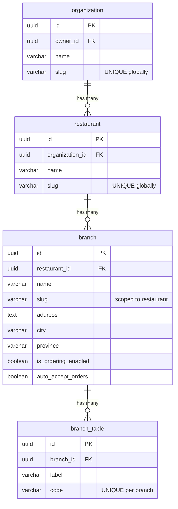

# Research: Branch Data Model & Slugs

## Summary

Branches exist as physical locations under restaurants. Each has a slug scoped to its restaurant (not globally unique). The proposed branch portal needs a **new globally-unique slug** for `/branch/:slug` routes.

## Entity Hierarchy



## Slug Uniqueness

| Entity | Slug Scope | DB Constraint | Collision Handling |
|--------|-----------|---------------|-------------------|
| Organization | Global | `UNIQUE` index | Random 4-char suffix |
| Restaurant | Global | `UNIQUE` index | Random suffix, throws on double collision |
| Branch | Per restaurant | Index only (no unique) | **None** — no collision check |

### Critical Finding

Branch slugs are **not globally unique** — only scoped to restaurant. The branch portal's `/branch/:slug` route needs a **new composite slug** format like `<restaurant-slug>-<branch-slug>` with global uniqueness.

## Current Slug Generation

All three entities use the same basic pattern:

```typescript
function generateSlug(name: string): string {
  return name.toLowerCase().trim()
    .replace(/[^a-z0-9\s-]/g, "")
    .replace(/\s+/g, "-")
    .replace(/-+/g, "-");
}
```

No shared utility — each service has its own copy.

## Branch Schema Fields

```typescript
branch = pgTable("branch", {
  id: uuid("id").primaryKey().defaultRandom(),
  restaurantId: uuid("restaurant_id").notNull().references(() => restaurant.id),
  name: varchar("name", { length: 200 }).notNull(),
  slug: varchar("slug", { length: 200 }).notNull(),
  address: text("address"),
  street: varchar("street", { length: 200 }),
  barangay: varchar("barangay", { length: 100 }),
  city: varchar("city", { length: 100 }),
  province: varchar("province", { length: 100 }),
  phone: varchar("phone", { length: 20 }),
  coverUrl: text("cover_url"),
  isOrderingEnabled: boolean("is_ordering_enabled").default(true),
  autoAcceptOrders: boolean("auto_accept_orders").default(false),
  paymentCountdownMinutes: integer("payment_countdown_minutes").default(15),
  latitude: numeric("latitude", { precision: 10, scale: 7 }),
  longitude: numeric("longitude", { precision: 10, scale: 7 }),
  amenities: jsonb("amenities").$type<string[]>().default([]),
  isActive: boolean("is_active").default(true),
});
```

**Indexes:** `restaurantId`, `slug`, `(province, city)`

## Branch Module API

| Procedure | Type | Purpose |
|-----------|------|---------|
| `listActiveTables` | public | List dining tables |
| `getBySlug` | public | Get by restaurant-scoped slug |
| `listPublicByRestaurant` | public | List active branches |
| `listByRestaurant` | protected | List all branches |
| `create` | protected | Create branch |
| `update` | protected | Update branch |
| `getOperatingHours` | protected | Get hours |
| `updateOperatingHours` | protected | Set hours |

## Public Customer Routes

Customer-facing routes use **restaurant slug**, not branch slug:
- `/restaurant/[slug]` — restaurant page (auto-selects primary branch)
- `/restaurant/[slug]/order/[orderId]` — order tracking

## Implications for Branch Portal

1. **Need a new globally-unique branch portal slug** — current branch slugs aren't unique
2. **Options:**
   - Add a new `portalSlug` column to branch table (globally unique)
   - Generate composite slug: `{restaurant.slug}-{branch.slug}` with collision handling
   - Use restaurant slug as namespace: `/branch/{restaurant-slug}/{branch-slug}` (two segments)
3. **Slug generation utility should be shared** — three copies of the same function exist
4. **Branch `getBySlug` needs a new variant** — current one requires `restaurantId`
