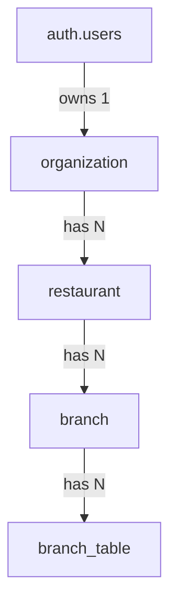
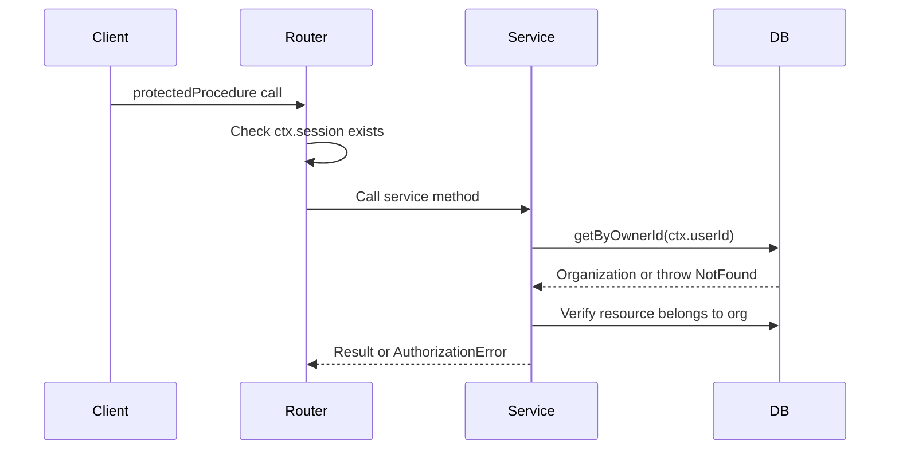

# Research: Current Auth & Role Model

## Summary

The current auth system is **simple and flat** — no team/membership model exists. Authorization is based on single-owner organization ownership, not scoped roles.

## Current Data Hierarchy



## User Roles (Global)

Single `user_roles` table with 1-to-1 user mapping:
- `admin` — platform admin (full system access)
- `member` — default for all users (read + write)
- `viewer` — read-only

**No organization-level roles.** No team membership. No branch-scoped access.

## Session Structure

```typescript
interface Session {
  userId: string;
  email: string;
  role: UserRole;                    // "admin" | "member" | "viewer"
  portalPreference: PortalPreference | null;  // "customer" | "owner"
}
```

Portal preference separates customer vs owner experience but is NOT a role.

## tRPC Procedure Types

| Procedure | Auth | Role Check |
|-----------|------|------------|
| `publicProcedure` | None | None |
| `protectedProcedure` | Session required | None |
| `adminProcedure` | Session + `role === "admin"` | Admin only |

**No `ownerProcedure` or `branchProcedure`** — owner access is checked at the service layer via ownership queries (`getByOwnerId()`).

## Authorization Pattern



## Invitation System

- Admin-only: only platform admins can create owner invitations
- No owner-to-team or owner-to-staff invite flows
- Token-based with expiry and revocation

## Gaps for Branch Ops + Team Access

1. **No team/membership model** — only single owner per organization
2. **No scoped role assignments** — roles are global, not org/branch-scoped
3. **No branch-level access control** — all or nothing via org ownership
4. **No owner-initiated invites** — only admin-created invitations exist
5. **No role update API** — no way to change roles after registration
6. **Session doesn't carry org/branch context** — only global role + portal preference
