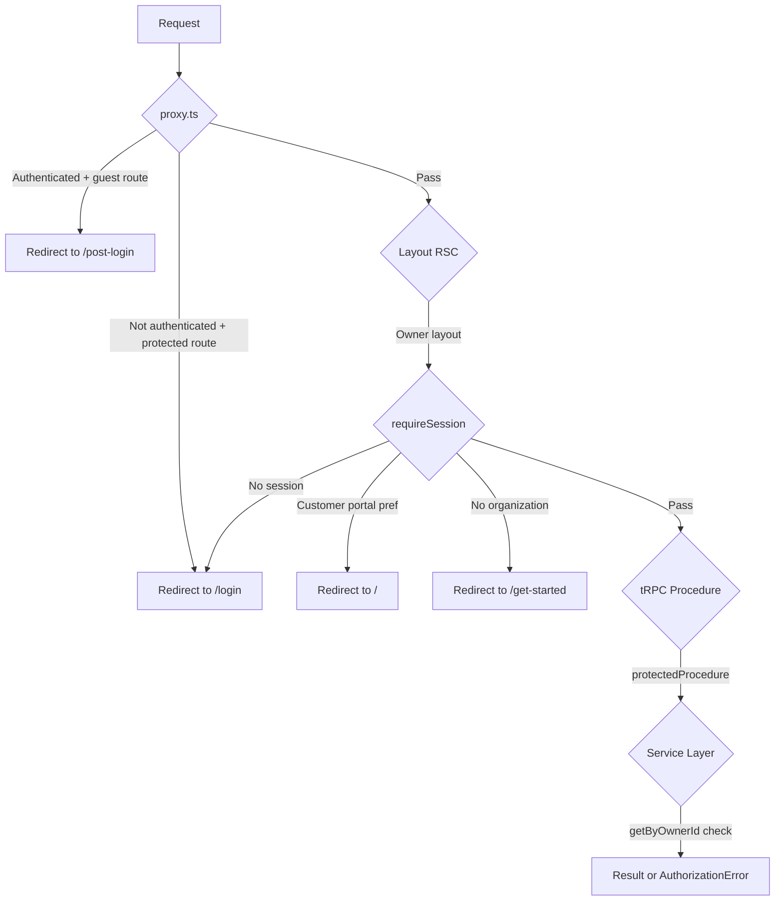

# Research: Middleware / Proxy Auth

## Summary

Route protection uses a **layered defense-in-depth** approach: proxy middleware → layout server component → tRPC middleware → service-layer ownership checks.

## Protection Layers

## Route Types

**File:** `src/common/app-routes.ts`

| Type | Routes | Auth Required | Extra Checks |
|------|--------|---------------|-------------|
| `public` | `/`, `/restaurant/*`, `/search`, `/guides` | No | None |
| `guest` | `/login`, `/register`, `/magic-link` | No (redirects if auth'd) | None |
| `protected` | `/orders`, `/saved`, `/account`, `/post-login` | Yes | None |
| `organization` | `/organization/**`, `/account/profile` | Yes | Portal pref + org existence |
| `admin` | `/admin/**` | Yes | `role === "admin"` |

## Proxy Middleware (`src/proxy.ts`)

- Runs on every request via Next.js middleware
- Refreshes Supabase session via `supabase.auth.getUser()`
- `isProtectedRoute()` returns true for: protected, organization, AND admin routes
- Unauthenticated users on protected routes → redirect to `/login` with `?redirect=`
- Authenticated users on guest routes → redirect to `/post-login` or `?redirect=` param

## Owner Layout Checks (`src/app/(owner)/layout.tsx`)

Three sequential checks:
1. `requireSession()` — authenticated or redirect to `/login`
2. `portalPreference === "customer"` → redirect to `/`
3. Organization exists for `ctx.userId` → redirect to `/get-started` if not

## No Branch-Level Route Protection

**Critical gap:** There is no branch-level access check in middleware or layouts. The owner layout verifies organization membership, but any authenticated owner can access any branch within their organization. There's no mechanism to restrict access to specific branches.

## Implications for Branch Portal

1. **New route group needed** — `(branch)` or similar for `/branch/:slug` routes
2. **New layout needed** — branch portal layout with branch-scoped session checks
3. **Proxy matcher update** — add `/branch/**` to protected route patterns
4. **Branch membership check** — new middleware or layout check for branch-scoped access
5. **Session enrichment** — may need to add branch membership info to context or check lazily per request
