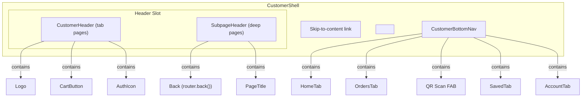
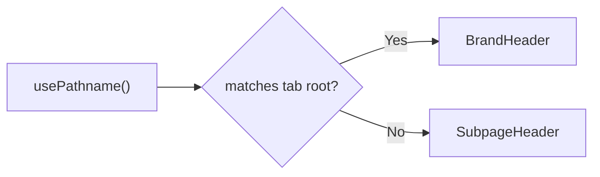

# Design — Customer Portal Navigation

## Overview

Add persistent navigation to the customer portal: a brand header, a 5-slot bottom navigation bar (4 tabs + center QR FAB), and a shared subpage header — replacing all ad-hoc per-page headers. Simultaneously fix accessibility landmarks, hardcoded colors, touch targets, and add portal switching for owner-role users.

This is a **hard cutover** — the existing ad-hoc headers are replaced entirely by shared components, not incrementally patched.

## Detailed Requirements

### Navigation Structure

- **Brand header** (top): Logo (left), Cart button + auth/profile icon (right). Sticky, visible on tab root pages.
- **Bottom nav** (bottom): 4 tabs — Home, Orders, Saved, Account — with a center QR scan FAB. Always visible on all pages.
- **Subpage header**: Back arrow (`router.back()`) + page title. Replaces brand header on non-tab pages (restaurant detail, order detail, search).
- **Cart icon** stays in the header (top-right), not in the bottom nav.
- Search lives in the Home hero — no dedicated Search tab.

### Auth Behavior

- Guests see all tabs. Tapping a protected tab (Orders, Saved, Account) navigates to the route; the existing proxy redirects to `/login?redirect=<target>`.
- Brand header shows "Sign in" button for guests, profile avatar/icon for authenticated users.
- No client-side auth gating on tab visibility.

### Portal Switching

- Account page shows "Switch to Owner Portal" link — only for users who belong to an organization.
- Detected via tRPC `organization.mine()` call.
- Same-tab navigation to `/organization`.
- Owner portal's sidebar should include a "Switch to Customer View" link back to `/`.

### Touch Targets

- Use shadcn/ui size variants as-is. No custom sizing overrides.
- Prefer `size="icon"` (36px) or `size="icon-lg"` (40px) for interactive elements.

### Accessibility

- Bottom nav wrapped in `<nav aria-label="Main navigation">`.
- Brand header wrapped in `<header>` (already is in `CustomerHeader`).
- Skip-to-content link as first focusable element in `CustomerShell`.
- Remove nested `<main>` tags from individual pages — shell provides the single `<main>`.
- Active tab indicated via `aria-current="page"`.

### Design Tokens

- Replace `from-[#fff8f2]` with `from-peach` on Orders, Saved, Account pages.
- All new components use design tokens — no hardcoded hex values.

### Cart Floating Button

- When bottom nav exists, `CartFloatingButton` must render above it (adjust bottom offset to clear the nav height).

## Architecture Overview



### Page Type Detection

The shell needs to know whether to show the brand header or the subpage header. Two approaches:

**Chosen approach — route-based config:**

Define tab root paths (`/`, `/orders`, `/saved`, `/account`) as constants. If the current pathname matches a tab root, show the brand header. Otherwise, show the subpage header. Pages provide their title via a context or prop.



## Components and Interfaces

### 1. CustomerShell (modified)

**File:** `src/components/layout/customer-shell.tsx`

```typescript
interface CustomerShellProps {
  children: React.ReactNode;
  className?: string;
}
```

**Changes:**
- Add skip-to-content link as first child
- Mount `CustomerHeader` or `SubpageHeader` based on route
- Mount `CustomerBottomNav` after `<main>`
- Remove `<main>` wrapper (moved to page-level concern) — actually keep `<main id="main-content">` here, remove from individual pages

### 2. CustomerHeader (modified)

**File:** `src/components/layout/customer-header.tsx`

```typescript
interface CustomerHeaderProps {
  className?: string;
}
```

**Changes:**
- Remove `showAuth` prop — always show auth state (sign-in for guests, profile icon for authenticated)
- Use `useSession()` to determine auth state
- Keep `showCart` and `cartCount` — wire to cart context
- Becomes a client component (already is)

### 3. SubpageHeader (new)

**File:** `src/components/layout/subpage-header.tsx`

```typescript
interface SubpageHeaderProps {
  title: string;
  label?: string;
  className?: string;
}
```

**Renders:** Sticky header with back button (`router.back()`), optional uppercase label, and page title. Consistent styling:
- `sticky top-0 z-40 border-b border-primary/10 bg-background/90 backdrop-blur`
- Back button: `size-10 rounded-full border border-primary/10`
- Label: `text-xs font-medium uppercase tracking-[0.24em] text-primary`
- Title: `font-heading text-xl font-bold`
- Container: `max-w-4xl` (normalized across all pages)

### 4. CustomerBottomNav (new)

**File:** `src/components/layout/customer-bottom-nav.tsx`

```typescript
// No props — reads route from usePathname(), auth from useSession()
```

**Renders:**
- `<nav aria-label="Main navigation">` wrapper
- Fixed bottom, z-40, safe-area-inset-bottom padding
- 5 slots: Home, Orders, QR FAB (center, elevated), Saved, Account
- Active tab highlighted via `usePathname()` match with `aria-current="page"`
- Icons: `Home`, `Receipt` (orders), `ScanLine` (QR), `Heart` (saved), `User` (account)

**Layout:**
```
┌─────────────────────────────────┐
│  Home   Orders  [QR]  Saved  Account │
└─────────────────────────────────┘
```

The QR FAB is visually elevated (larger, primary color, raised above the nav bar line) but structurally part of the nav.

### 5. PageHeader Context (new)

**File:** `src/components/layout/page-header-context.tsx`

```typescript
interface PageHeaderConfig {
  title: string;
  label?: string;
}

// Context + provider + hook for pages to declare their header config
```

Pages call `useSetPageHeader({ title: "Order history", label: "Retention" })` to configure the subpage header. Tab root pages don't call it — the shell shows the brand header instead.

## Data Models

No database changes. All navigation state is client-side (pathname, session).

Portal switching uses existing data:
- `useSession()` → `portalPreference`
- tRPC `organization.mine()` → determines if user has an org

## Error Handling

- **Session loading:** Bottom nav renders all tabs immediately. Auth state loads async — auth icon shows a skeleton/placeholder until resolved.
- **Organization check for portal switch:** Account page checks org ownership. If the call fails, the switch link simply doesn't render. No error UI.
- **QR scanner failure:** Existing `QrScannerModal` handles camera permission errors — no change needed.

## Acceptance Criteria

### AC1: Persistent Header
- **Given** a user on any tab root page (/, /orders, /saved, /account)
- **When** the page loads
- **Then** a sticky header is visible with logo (left), cart button and auth icon (right)

### AC2: Subpage Header
- **Given** a user on a non-tab page (e.g., /restaurant/[slug], /search)
- **When** the page loads
- **Then** a sticky header shows a back arrow and page title (no logo)
- **And** tapping back calls `router.back()`

### AC3: Bottom Navigation
- **Given** a user on any customer portal page
- **When** the page loads
- **Then** a bottom navigation bar is visible with Home, Orders, QR scan, Saved, Account
- **And** the active tab is highlighted matching the current route

### AC4: QR Scan FAB
- **Given** the bottom nav is visible
- **When** the user taps the center QR button
- **Then** the QR scanner modal opens
- **And** the standalone `ScanQRCTA` floating button is no longer rendered

### AC5: Guest Auth Flow
- **Given** an unauthenticated user
- **When** they tap Orders, Saved, or Account in the bottom nav
- **Then** the app navigates to the route and the proxy redirects to `/login?redirect=<target>`

### AC6: Portal Switch
- **Given** an authenticated user who belongs to an organization
- **When** they visit the Account page
- **Then** a "Switch to Owner Portal" link is visible
- **And** tapping it navigates to `/organization` in the same tab

### AC7: Portal Switch (non-owner)
- **Given** an authenticated user without an organization
- **When** they visit the Account page
- **Then** no portal switch link is shown

### AC8: Accessibility Landmarks
- **Given** any customer portal page
- **When** a screen reader inspects the page structure
- **Then** there is exactly one `<main>`, one `<header>`, one `<nav aria-label="Main navigation">`, and a skip-to-content link

### AC9: No Nested Main Tags
- **Given** any customer portal page
- **When** the HTML is inspected
- **Then** there is exactly one `<main>` element (from CustomerShell, not from individual pages)

### AC10: Design Token Compliance
- **Given** the Orders, Saved, and Account pages
- **When** the page renders
- **Then** the background gradient uses `from-peach` (not `from-[#fff8f2]`)

### AC11: Ad-Hoc Header Removal
- **Given** any page that previously had an inline header (saved, orders, account, search, order detail)
- **When** the page renders
- **Then** the page does not render its own `<header>` — the shell handles it

### AC12: Cart Float Above Nav
- **Given** a restaurant page with items in the cart
- **When** the CartFloatingButton renders
- **Then** it is positioned above the bottom nav (not overlapping)

## Testing Strategy

### Unit Tests
- `SubpageHeader` renders back button and title
- `CustomerBottomNav` highlights correct tab for each route
- `CustomerBottomNav` renders QR scan FAB that opens modal
- Tab root detection logic correctly identifies `/`, `/orders`, `/saved`, `/account`
- Skip-to-content link present in shell

### Integration Tests
- Navigate between tabs — header switches between brand and subpage modes
- Guest tapping protected tab → redirect to login with correct redirect param
- Authenticated user with org sees portal switch on account page
- Authenticated user without org does not see portal switch

### E2E Tests
- Full navigation flow: Home → tap Orders tab → login redirect → post-login → arrive at Orders
- QR scan: tap FAB → modal opens → scan or close
- Back button: navigate to restaurant → tap back → returns to previous page

### Visual / Manual Tests
- Bottom nav aligns with safe area on notched devices
- Cart floating button clears the bottom nav
- No double headers on any page
- Gradient uses peach token (inspect computed styles)

## Appendices

### A. Technology Choices

- **Next.js App Router** — existing stack, route groups `(public)` already in place
- **React Context** for page header config — lightweight, no external deps
- **usePathname()** from `next/navigation` for tab detection — already used elsewhere
- **Lucide icons** — already the icon library in use
- **shadcn/ui Button** — reused for all interactive elements in nav

### B. Research Findings

- `CustomerHeader` exists but is never mounted — can be adapted rather than rebuilt
- `BackButton` component exists but is unused — pages use inline `ArrowLeft` instead; `SubpageHeader` will use `BackButton` or similar pattern
- `CartFloatingButton` uses `fixed bottom-0 z-40` with safe-area-inset — same pattern needed for bottom nav
- Owner detection works via `organization.mine()` tRPC call — no new API needed
- Auth redirect chain (`proxy.ts` → `/login?redirect=`) is fully wired — just needs front-door links

### C. Alternative Approaches Considered

1. **Separate layout routes** — Create `(tab)` and `(subpage)` route groups with different layouts. Rejected: would require moving files and complicates the route structure.
2. **Page-level header props** — Pass header config as layout props via `generateMetadata`. Rejected: metadata is for `<head>`, not UI layout.
3. **No subpage header, just brand header always** — Rejected: subpages need contextual back navigation, and the brand header doesn't provide page identity.
4. **Bottom nav hides on deep pages** — Initially considered, user decided always-visible is the right mobile UX.

### D. Files to Create

| File | Purpose |
|------|---------|
| `src/components/layout/customer-bottom-nav.tsx` | Bottom navigation bar with 4 tabs + QR FAB |
| `src/components/layout/subpage-header.tsx` | Shared contextual header for non-tab pages |
| `src/components/layout/page-header-context.tsx` | Context for pages to declare their header config |

### E. Files to Modify

| File | Changes |
|------|---------|
| `src/components/layout/customer-shell.tsx` | Mount header, bottom nav, skip-to-content, remove bare wrapper |
| `src/components/layout/customer-header.tsx` | Always show auth state, remove `showAuth` prop |
| `src/features/discovery/components/scan-qr-cta.tsx` | Remove or gate — replaced by bottom nav FAB |
| `src/app/(public)/page.tsx` | Remove `pb-24` hack, remove nested `<main>` |
| `src/features/saved-restaurants/components/saved-restaurants-page.tsx` | Remove ad-hoc header, remove nested `<main>`, use `from-peach` |
| `src/features/orders/components/customer-orders-page.tsx` | Remove ad-hoc header, remove nested `<main>`, use `from-peach` |
| `src/features/customer-account/components/customer-account-page.tsx` | Remove ad-hoc header, remove nested `<main>`, use `from-peach`, add portal switch |
| `src/app/(public)/search/page.tsx` | Remove ad-hoc header, set page header via context |
| `src/features/cart/components/cart-floating-button.tsx` | Adjust bottom offset to clear bottom nav |
