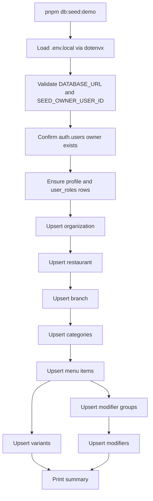
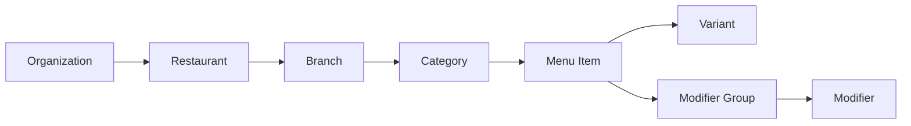

# Database Seeds Design

## Overview

This design introduces a local-development database seed flow for CravingsPH that mirrors the operational style of the reference repo while matching the current restaurant/menu schema in this codebase.

The first implementation targets one realistic demo restaurant tree that is useful for:

- owner-facing restaurant and menu management,
- customer-facing public menu browsing,
- exercising categories, variants, required modifiers, and optional add-ons.

The design is intentionally conservative around authentication. Rather than creating Supabase auth users directly, the seed flow requires a known owner user ID and builds the restaurant graph underneath it.

## Detailed Requirements

1. The repo must support a runnable seed command similar in shape to the reference boilerplate scripts.
2. Seed execution must target local development by default.
3. The seed flow must validate `DATABASE_URL` before attempting writes.
4. The seed flow must validate a known owner user ID before creating an organization.
5. The seed flow must be idempotent and safe to rerun.
6. The first fixture set must seed a realistic restaurant/menu graph, not just placeholder rows.
7. The seeded data must be useful for public menu pages and owner management pages.
8. The flow must emit readable console output summarizing created versus skipped rows.
9. The implementation must avoid destructive resets as part of the default seed command.
10. The seed logic should keep fixture data separate from insertion logic to improve maintainability.

## Architecture Overview

### Proposed Files

- `scripts/seed-demo-restaurant.ts`
- `scripts/seed-data/demo-restaurant.ts`
- optional test files under `src/__tests__/scripts/` or a similar existing test location
- `package.json` script entries for seed execution

### Execution Flow



### Idempotency Strategy

Because most child tables do not have database-level uniqueness constraints, the seed script should define stable lookup rules in code and only insert missing records.

Recommended matching keys:

- organization by `slug`
- restaurant by `slug`
- branch by `restaurantId + slug`
- category by `branchId + name`
- menu item by `categoryId + name`
- variant by `menuItemId + name`
- modifier group by `menuItemId + name`
- modifier by `modifierGroupId + name`

## Components And Interfaces

### 1. Seed Runner

`scripts/seed-demo-restaurant.ts`

Responsibilities:

- load environment,
- create database connection,
- validate prerequisites,
- orchestrate inserts,
- print summary,
- exit with non-zero status on failure.

### 2. Fixture Module

`scripts/seed-data/demo-restaurant.ts`

Responsibilities:

- export typed seed data for one demo restaurant tree,
- keep content editable without touching insert logic,
- make it easy to add more fixtures later.

Suggested fixture shape:

```ts
type DemoSeed = {
  organization: { name: string; slug: string; description?: string };
  restaurant: { name: string; slug: string; cuisineType?: string };
  branch: {
    name: string;
    slug: string;
    city?: string;
    province?: string;
    address?: string;
  };
  categories: Array<{
    name: string;
    sortOrder: number;
    items: Array<{
      name: string;
      description?: string;
      basePrice: string;
      sortOrder: number;
      isAvailable?: boolean;
      variants?: Array<{ name: string; price: string; sortOrder: number }>;
      modifierGroups?: Array<{
        name: string;
        isRequired: boolean;
        minSelections: number;
        maxSelections: number;
        sortOrder: number;
        modifiers: Array<{ name: string; price: string; sortOrder: number }>;
      }>;
    }>;
  }>;
};
```

### 3. Owner Prerequisite Validation

The seed runner should require:

- `DATABASE_URL`
- `SEED_OWNER_USER_ID`

Validation rules:

- fail if either variable is absent,
- fail if `auth.users` does not contain the supplied user ID,
- optionally create or update related `profile` and `user_roles` rows.

### 4. Summary Reporter

The script should keep created/skipped counters per entity type:

- profile
- user role
- organization
- restaurant
- branch
- category
- menu item
- item variant
- modifier group
- modifier

## Data Models

### Demo Data Scope

The first fixture should seed one cohesive demo restaurant such as a Filipino comfort-food concept with enough variation to exercise the UI.

Recommended content:

- 1 organization
- 1 restaurant
- 1 branch
- 4 to 6 categories
- 2 to 4 items per category
- variants on selected drinks or rice meals
- required modifier groups on selected items
- optional add-on groups on selected items

### Data Relationship Diagram



### Non-Seeded Scope For This Pass

This design intentionally excludes:

- orders,
- payments,
- verification documents,
- realtime setup,
- admin seed data,
- direct auth user creation.

Those can be added later after the base restaurant/menu seed is working.

## Error Handling

The seed runner should fail fast and clearly in these cases:

1. `DATABASE_URL` missing.
2. `SEED_OWNER_USER_ID` missing.
3. Owner auth user not found.
4. Any insert/update operation fails.
5. Fixture data is structurally invalid.

Recommended output behavior:

- print the failing step,
- print the relevant identifier or lookup key,
- exit with code `1`,
- always close the Postgres client.

## Acceptance Criteria

1. Given `.env.local` contains a valid `DATABASE_URL` and `SEED_OWNER_USER_ID`, when `pnpm db:seed:demo` runs against an empty local database, then it creates one demo organization, restaurant, branch, categories, items, variants, modifier groups, and modifiers.
2. Given the owner auth user exists but `profile` and `user_roles` rows do not, when the seed runs, then the script creates those supporting rows before creating the organization.
3. Given the seed has already been run once, when it is run again with the same fixture data, then it does not create duplicate rows and instead reports skipped or existing records.
4. Given `DATABASE_URL` is missing, when the seed starts, then it fails before opening the write flow and prints a clear configuration error.
5. Given `SEED_OWNER_USER_ID` is missing, when the seed starts, then it fails before any inserts occur and explains the missing prerequisite.
6. Given `SEED_OWNER_USER_ID` does not match an auth user, when the seed starts, then it exits with a clear prerequisite failure and creates nothing in the restaurant graph.
7. Given the seed completes successfully, when the operator reads stdout, then they can see created and skipped counts per entity type.
8. Given the seeded branch is opened in the customer menu experience, when the menu renders, then categories, items, variants, and modifiers are available for UI testing.

## Testing Strategy

1. Add unit coverage for fixture integrity if practical, especially stable names/slugs and required nested fields.
2. Add focused tests for helper functions that implement lookup-or-create behavior.
3. Manually verify idempotency by running the seed twice on the same local database.
4. Manually verify the owner portal can load the seeded restaurant and branch.
5. Manually verify the public menu can render the seeded branch menu.

## Appendices

### Technology Choices

- `tsx` for script execution to match the reference repo
- `dotenvx` for env loading
- `drizzle-orm` with `postgres`
- schema imports from `src/shared/infra/db/schema`

### Research Findings Summary

- The repo already has the needed menu hierarchy in Drizzle.
- No seed script exists yet.
- The main design constraint is the foreign key to Supabase auth.
- The reference repo’s script ergonomics are a good fit and should be copied.

### Alternative Approaches

#### Alternative 1: Seed Directly Into `auth.users`

Rejected for the first pass because it is more brittle and couples the script to Supabase auth internals.

#### Alternative 2: Build A Full Multi-Tenant Fixture Matrix

Rejected for the first pass because one high-quality demo restaurant gives better signal than many shallow fixtures.

#### Alternative 3: Put Fixture Data Inline In The Runner

Rejected because it makes the script harder to test and maintain as the menu grows.
