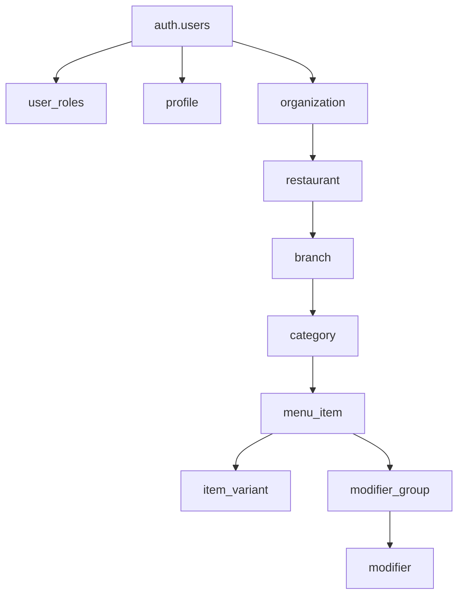

# Research: Current State And Schema

## Goal

Understand the current CravingsPH database and application shape so the seed strategy matches the real codebase rather than the boilerplate reference.

## Findings

1. The repo uses Drizzle with `postgres` and a central schema export in `src/shared/infra/db/schema/index.ts`.
2. There is no existing `scripts/` seed implementation in this repo yet, and `package.json` currently has migration scripts but no `db:seed` command.
3. The current restaurant/menu schema already supports a usable demo tree:
   - `organization`
   - `restaurant`
   - `branch`
   - `category`
   - `menu_item`
   - `item_variant`
   - `modifier_group`
   - `modifier`
4. `organization.ownerId` references Supabase `auth.users`, so seeding restaurant data requires a valid owner user ID.
5. The app also has `profile` and `user_roles` tables linked to the same auth user, which can be optionally populated to improve owner-facing UI completeness.
6. The product docs show the seed data should support at least:
   - owner onboarding and restaurant management,
   - branch menu editing,
   - customer menu browsing with categories, variants, and modifiers.

## Relationship Model

## Seed-Relevant Constraints

### Constraint 1: Owner Foreign Key

The first meaningful seedable entity in the restaurant graph is `organization`, but it cannot be created without an existing `auth.users.id`.

Impact:

- A seed script cannot be fully standalone unless it also creates an auth user.
- Creating auth users directly inside a first-pass Drizzle script is risky because Supabase Auth has non-trivial expectations.

### Constraint 2: No Natural Uniqueness On Most Child Rows

Only some top-level tables expose natural uniqueness in the schema, such as:

- `organization.slug`
- `restaurant.slug`

Many child tables use only foreign keys plus names and sort order, with no database uniqueness constraints.

Impact:

- Idempotent seed logic should use stable lookup keys in code, not blind inserts.
- The seed plan should define explicit matching rules per table, for example:
  - category by `branchId + name`
  - item by `categoryId + name`
  - variant by `menuItemId + name`
  - modifier group by `menuItemId + name`
  - modifier by `modifierGroupId + name`

### Constraint 3: Development Utility Matters More Than Breadth

The current product state benefits most from one high-quality demo organization with one restaurant, one branch, and a realistic menu hierarchy rather than a large volume of generic rows.

Impact:

- The first seed should optimize for usefulness in local UI flows.
- Additional fixtures can be added later after the first demo path works.

## Recommendation

Start with a single local-development seed path that creates:

1. optional `profile` and `user_roles` rows for a known owner user,
2. one demo organization,
3. one demo restaurant,
4. one demo branch,
5. multiple categories,
6. multiple items,
7. representative variants and modifier groups.

## Sources

- `package.json`
- `src/shared/infra/db/drizzle.ts`
- `src/shared/infra/db/schema/index.ts`
- `src/shared/infra/db/schema/organization.ts`
- `src/shared/infra/db/schema/profile.ts`
- `src/shared/infra/db/schema/user-roles.ts`
- `src/shared/infra/db/schema/restaurant.ts`
- `src/shared/infra/db/schema/branch.ts`
- `src/shared/infra/db/schema/category.ts`
- `src/shared/infra/db/schema/menu-item.ts`
- `src/shared/infra/db/schema/item-variant.ts`
- `src/shared/infra/db/schema/modifier-group.ts`
- `src/shared/infra/db/schema/modifier.ts`
- `docs/prd.md`
- `docs/implementation-intent.md`
