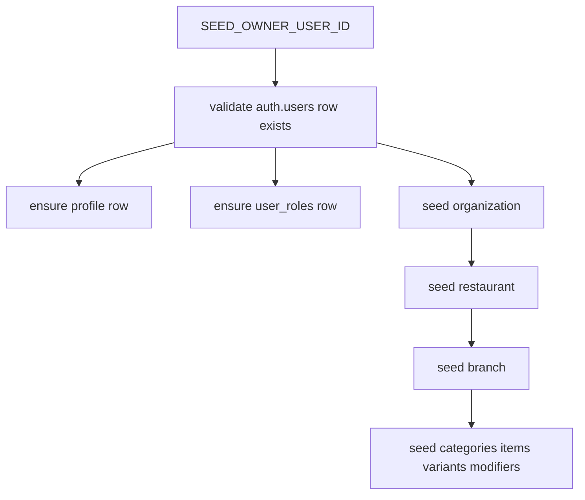

# Research: Owner Auth Strategy

## Goal

Choose a practical way to satisfy the `organization.ownerId -> auth.users.id` dependency during local seeding.

## Options

### Option A: Insert Directly Into `auth.users`

Pros:

- fully self-contained seed script,
- one command could create everything.

Cons:

- higher risk because Supabase Auth tables are not ordinary app-owned tables,
- likely requires auth-specific fields and conventions,
- harder to keep portable and safe.

### Option B: Require An Existing Owner User ID

Pros:

- safest first implementation,
- minimal coupling to Supabase internals,
- easy to validate before any writes occur,
- aligns with app behavior where owner identity already exists.

Cons:

- requires one manual prerequisite for first-time local setup.

### Option C: Use Supabase Admin API To Create The Owner

Pros:

- avoids writing directly to `auth.users`,
- can be automated later.

Cons:

- needs service-role level configuration,
- adds external API concerns to a first-pass local seed,
- more moving parts than the current ask needs.

## Decision

Recommend **Option B** for the first implementation.

The seed script should require a known owner user ID via environment variable, for example:

- `SEED_OWNER_USER_ID`

Behavior:

1. Fail fast if the env var is missing.
2. Check that the auth user exists.
3. Upsert `profile` and `user_roles` rows for completeness.
4. Seed the organization, restaurant, branch, and menu graph under that owner.

## Dependency Diagram

## Why This Fits CravingsPH Best

- The repo already assumes authenticated owner flows.
- The first useful goal is a working menu and owner workspace, not a complete auth bootstrap toolchain.
- This keeps the first seed implementation narrow, testable, and reversible.

## Follow-Up

If local developer ergonomics later require a single-command bootstrap, a second script can be added to create the owner through the Supabase admin API. That should be a separate step from the initial seed rollout.

## Sources

- `src/shared/infra/db/schema/organization.ts`
- `src/shared/infra/db/schema/profile.ts`
- `src/shared/infra/db/schema/user-roles.ts`
- `src/shared/infra/db/drizzle.ts`
