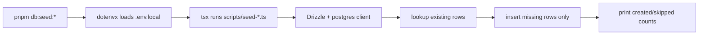

# Research: Reference Seed Pattern

## Goal

Extract the useful conventions from the reference repo so the new CravingsPH seed scripts feel native to the existing engineering workflow.

## Reference Pattern

The boilerplate repo uses simple TypeScript scripts under `scripts/` and exposes them through `package.json` scripts with `dotenvx` and `tsx`.

Example pattern:

- script file: `scripts/seed-sports.ts`
- package command: `dotenvx run --env-file=.env.local -- tsx scripts/seed-sports.ts`

## What The Reference Script Gets Right

1. It is explicit and easy to run.
2. It validates `DATABASE_URL` up front.
3. It connects with Drizzle directly instead of depending on runtime app boot.
4. It is idempotent by checking for existing rows before inserting.
5. It prints a small summary so the operator can see what changed.

## Flow Diagram



## What Should Change For CravingsPH

The CravingsPH seed path should keep the same operational model but adapt to a more relational data graph.

Differences from `seed-sports.ts`:

1. The seed target is hierarchical rather than flat.
2. Multiple child tables need deterministic lookup rules for idempotency.
3. The script needs an owner-user prerequisite because `organization.ownerId` references `auth.users`.
4. The fixture data should represent real restaurant/menu flows rather than a taxonomy list.

## Recommended Command Shape

For this repo, the cleanest command shape is:

- `db:seed:demo`
- optional alias: `db:seed`

Recommended package command form:

```json
"db:seed:demo": "dotenvx run --env-file=.env.local -- tsx scripts/seed-demo-restaurant.ts"
```

## Script Structure Recommendation

Prefer a small split:

- `scripts/seed-demo-restaurant.ts`
- `scripts/seed-data/demo-restaurant.ts`

Why:

- keeps fixture data separate from insertion logic,
- makes the seed easier to test,
- allows future fixture variants without rewriting the runner.

## Sources

- `/Users/raphaelm/Documents/Coding/boilerplates/next16bp/scripts/seed-sports.ts`
- `/Users/raphaelm/Documents/Coding/boilerplates/next16bp/package.json`
