# Design Document — PRD v4 Gap Closure

> **Purpose:** Close all identified gaps between the CravingsPH PRD v4 and the current codebase implementation, achieving MVP dine-in reliability.

---

## Overview

The codebase audit identified **35 requirements** across 5 PRD journeys. **22 are fully implemented**, **8 are partial**, and **5 are missing**. This design addresses all 13 gaps, organized into 6 workstreams ordered by criticality to the MVP dine-in loop.

The core theme: **the backend is generally ahead of the frontend**. Most gaps involve wiring existing tRPC procedures to React components, upgrading UI controls, or adding thin schema extensions.

---

## Detailed Requirements (Consolidated)

### From Journey 1 — Discovery & Search
- R1: Cuisine filter must support multi-select with predefined options
- R2: Barangay filter must be exposed in UI for both search modes
- R3: Location fallback to current geolocation when no barangay/city selected

### From Journey 2 — Owner Setup
- R4: Cuisine type field on restaurant must be multi-select array (not single string)
- R5: Branch schema needs `profileUrl` field; branch form needs media upload UI
- R6: Menu builder in onboarding is placeholder (deferred — acceptable for MVP)

### From Journey 3 — Dine-in Ordering
- R7: QR codes must encode table number; restaurant route must parse table context
- R8: Order submission must call real `order.create` tRPC mutation (currently stubbed)
- R9: Cart must store `branchId` (not just `branchSlug`) for order creation
- R10: `tableNumber` must be required for dine-in orders
- R11: Order tracking page must use real data (currently hard-coded stubs)

### From Journey 5 — Governance
- R12: Decide verification flow scope — keep, simplify, or remove
- R13: Admin dashboard "Orders today" metric needs wiring

---

## Architecture Overview

```mermaid
graph TD
    subgraph "Workstream 1: Dine-in Order Loop (Critical Path)"
        A[QR encodes table + branch] --> B[Restaurant route parses ?table param]
        B --> C[Cart stores branchId + tableNumber]
        C --> D[Checkout calls order.create mutation]
        D --> E[Order tracking fetches real data]
    end

    subgraph "Workstream 2: Search Parity"
        F[Cuisine → multi-select array] --> G[Search filter UI upgrade]
        G --> H[Barangay filter added to both modes]
        H --> I[Geolocation fallback]
    end

    subgraph "Workstream 3: Owner Setup Polish"
        J[Restaurant cuisineType → array in schema]
        K[Branch profileUrl field + upload UI]
    end

    subgraph "Workstream 4: Governance Decisions"
        L[Verification flow decision]
        M[Dashboard metrics wiring]
    end
```



---

## Components and Interfaces

### Workstream 1: Dine-in Order Loop (R7–R11)

This is the **critical path** — without it, the core dine-in promise doesn't work end-to-end.

#### 1A. QR Code + Table Context (R7)

**Current state:** QR encodes `cravings.ph/restaurant/{slug}`. No table info.

**Target state:** QR encodes `cravings.ph/restaurant/{slug}?table={number}`

**Changes:**

| File | Change |
|---|---|
| `src/features/branch-settings/components/qr-code-preview.tsx` | Add table number selector; encode `?table=N` in QR URL |
| `src/app/(public)/restaurant/[slug]/page.tsx` | Read `searchParams.table`, pass to menu component |
| `src/features/menu/components/restaurant-menu.tsx` | Accept `tableNumber` prop, store in cart on first item add |

**Design decision — No table session entity for MVP.** Table number is a string from the QR param, stored directly on the order. This avoids schema complexity. If table session management is needed later (occupancy tracking, multi-order grouping), it can be added as a separate entity without breaking the MVP flow.

#### 1B. Cart Branch ID Resolution (R9)

**Current state:** Cart store holds `branchSlug: string`. Order creation needs `branchId: string (UUID)`.

**Target state:** Cart stores both `branchSlug` and `branchId`.

**Changes:**

| File | Change |
|---|---|
| `src/features/cart/stores/cart.store.ts` | Add `branchId: string \| null` field. Update `setBranch()` to accept both slug and ID |
| `src/features/menu/components/restaurant-menu.tsx` | Pass `branchId` when initializing cart (available from restaurant page data) |
| `src/app/(public)/restaurant/[slug]/page.tsx` | Ensure `branchId` is passed down alongside `branchSlug` |

#### 1C. Order Submission Wiring (R8, R10)

**Current state:** `handleCheckoutSubmit` in `restaurant-menu.tsx` uses `setTimeout` + fake UUID.

**Target state:** Calls `trpc.order.create` with real data.

**Changes:**

| File | Change |
|---|---|
| `src/features/menu/components/restaurant-menu.tsx` | Replace TODO block with `order.create` mutation call. Map cart items to `CreateOrderInputSchema` format |
| `src/features/checkout/components/checkout-sheet.tsx` | Make `tableNumber` required when `orderType === "dine-in"`. Pre-fill from QR param if available. Show validation error if empty |
| `src/modules/order/dtos/order.dto.ts` | Add refinement: if `orderType === "dine-in"`, `tableNumber` is required |

**Order creation payload:**
```typescript
{
  branchId: string,          // from cart store
  orderType: "dine-in",
  tableNumber: string,       // required for dine-in
  specialInstructions?: string,
  items: Array<{
    menuItemId: string,
    variantId?: string,
    quantity: number,
    modifiers: Array<{ modifierId: string, quantity: number }>,
    specialInstructions?: string,
  }>
}
```

#### 1D. Order Tracking (R11)

**Current state:** `/restaurant/[slug]/order/[orderId]` page uses `STUB_ORDER` hard-coded data.

**Target state:** Fetches real order via tRPC and shows live updates.

**Changes:**

| File | Change |
|---|---|
| `src/app/(public)/restaurant/[slug]/order/[orderId]/page.tsx` | Replace stub with `trpc.order.getDetail` query. Add polling interval (e.g., 10s) via `refetchInterval` for status updates |
| `src/features/order-tracking/components/order-status-tracker.tsx` | Ensure component accepts real order data shape (verify prop interface matches `order.getDetail` return type) |

**Note:** PRD mentions Supabase Realtime but polling via `refetchInterval` is acceptable for MVP. Realtime can be layered on later.

---

### Workstream 2: Search Parity (R1–R3)

#### 2A. Cuisine Multi-Select (R1, R4)

**Current state:** Single text input for restaurant cuisine; single-select filter in search.

**Target state:** Multi-select with predefined options + free additions.

**Schema change (R4):**

| File | Change |
|---|---|
| `src/shared/infra/db/schema/restaurant.ts` | Add `cuisineTypes: text("cuisine_types").array()` column alongside existing `cuisineType` (migration adds new column, backfills from old, then drops old) |
| Migration | `ALTER TABLE restaurant ADD COLUMN cuisine_types TEXT[] DEFAULT '{}'` + backfill |

**Backend changes:**

| File | Change |
|---|---|
| `src/modules/discovery/dtos/discovery.dto.ts` | Change `cuisine` from `z.string()` to `z.array(z.string()).optional()` (accept comma-separated in URL, parse to array) |
| `src/modules/discovery/repositories/discovery.repository.ts` | Replace single `ilike(restaurant.cuisineType, ...)` with array overlap query using `arrayOverlaps()` or multiple `ilike` conditions |
| `src/modules/restaurant/dtos/restaurant.dto.ts` | Change `cuisineType` to `cuisineTypes: z.array(z.string()).min(1)` with predefined enum suggestions |

**Frontend changes:**

| File | Change |
|---|---|
| `src/features/discovery/components/cuisine-filter.tsx` | Convert to multi-select toggle buttons. Multiple active selections allowed. URL param becomes `cuisine=filipino,japanese` |
| `src/features/onboarding/components/restaurant-form.tsx` | Replace text input with multi-select button group. Predefined: Filipino, Japanese, Korean, Chinese, French, Italian, Mexican, Cafe, Bakery. Allow custom additions |
| `src/app/(public)/search/page.tsx` | Parse `cuisine` param as comma-separated array; pass array to tRPC query |

**Predefined cuisine options:**
```typescript
const CUISINE_OPTIONS = [
  "Filipino", "Japanese", "Korean", "Chinese",
  "French", "Italian", "Mexican", "Cafe", "Bakery",
] as const;
```

#### 2B. Barangay Filter (R2)

**Current state:** Backend supports `barangay` param in search DTOs. No frontend UI. Location filter shows cities only.

**Target state:** Barangay multi-select filter visible in both search modes.

**Changes:**

| File | Change |
|---|---|
| `src/features/discovery/components/location-filter.tsx` | Add barangay selection (either as sub-filter after city selection, or as separate component). Support multi-select |
| `src/app/(public)/search/page.tsx` | Show location filter in food mode too (currently hidden). Pass `barangay` param to food search query |
| `src/modules/discovery/dtos/discovery.dto.ts` | Update `barangay` to support array: `z.array(z.string()).optional()` |

**Implementation approach:** When user selects a city, show available barangays for that city as multi-select chips/pills. Backend already has barangay data on branches.

#### 2C. Geolocation Fallback (R3)

**Current state:** No geolocation integration.

**Target state:** When no location filter is selected, default to user's current location.

**Changes:**

| File | Change |
|---|---|
| New: `src/features/discovery/hooks/use-geolocation.ts` | Hook wrapping `navigator.geolocation.getCurrentPosition`. Returns `{ latitude, longitude, city, barangay, loading, error }`. Reverse geocodes to city/barangay using a simple lookup or API |
| `src/app/(public)/search/page.tsx` | Use geolocation hook as fallback when no location params set. Pass derived city/barangay to search queries |
| `src/modules/discovery/dtos/discovery.dto.ts` | Add optional `latitude`/`longitude` params for proximity-based search |
| `src/modules/discovery/repositories/discovery.repository.ts` | Add distance-based ordering when lat/lng provided (PostGIS `ST_Distance` or Haversine formula) |

**MVP simplification:** For MVP, reverse geocoding to barangay may be complex. Alternative: accept lat/lng and sort results by distance using Haversine formula in SQL. This achieves "nearby results" without needing exact barangay matching.

---

### Workstream 3: Owner Setup Polish (R5)

#### 3A. Branch Profile Picture (R5)

**Changes:**

| File | Change |
|---|---|
| `src/shared/infra/db/schema/branch.ts` | Add `profileUrl: text("profile_url")` column |
| Migration | `ALTER TABLE branch ADD COLUMN profile_url TEXT` |
| `src/features/onboarding/components/branch-form.tsx` | Add image upload fields for both profile picture and cover image |
| `src/modules/branch/dtos/branch.dto.ts` | Add `profileUrl: z.string().url().optional()` to create/update schemas |

**Note:** Image upload infrastructure (Supabase Storage) is assumed to already exist for other features. Reuse the same upload pattern.

---

### Workstream 4: Governance Decisions (R12–R13)

#### 4A. Verification Flow Decision (R12)

**Options:**

| Option | Description | Recommendation |
|---|---|---|
| A. Keep as-is | Admin invites → Owner registers → Submits docs → Admin reviews | Adds friction; redundant if admin pre-vetted |
| B. Simplify | Admin invites with pre-collected info → Owner registers → Auto-approved | Streamlines; trust the invitation as verification |
| **C. Defer** | **Skip onboarding steps (already done), decide later** | **Recommended for MVP — steps already skip-only** |

The verification steps are already skip-only placeholders. No code removal needed for MVP. Decision on full removal vs. simplification can be made post-launch.

#### 4B. Dashboard Metrics (R13)

**Changes:**

| File | Change |
|---|---|
| `src/modules/admin/services/admin.service.ts` | Wire up "Orders today" count query (count orders where `createdAt >= today`) |
| `src/modules/admin/repositories/admin.repository.ts` | Add query for daily order count |

---

## Data Models

### Schema Changes Summary

```sql
-- 1. Restaurant: cuisineType → cuisineTypes (array)
ALTER TABLE restaurant ADD COLUMN cuisine_types TEXT[] DEFAULT '{}';
UPDATE restaurant SET cuisine_types = ARRAY[cuisine_type] WHERE cuisine_type IS NOT NULL;
ALTER TABLE restaurant DROP COLUMN cuisine_type;

-- 2. Branch: add profileUrl
ALTER TABLE branch ADD COLUMN profile_url TEXT;

-- 3. Order: tableNumber enforcement (application-level, not schema)
-- tableNumber remains nullable in schema for pickup orders
-- Application validates: if orderType = 'dine-in', tableNumber is required
```

### No New Tables Required

The MVP approach avoids new entities (no `table`, no `table_session`). Table number is a string value from QR → cart → order. This keeps the schema simple while achieving the dine-in promise.

---

## Error Handling

| Scenario | Handling |
|---|---|
| QR scanned without table param | Allow browsing, but require table number at checkout before submission |
| Branch ordering disabled | `BranchNotAcceptingOrdersError` already thrown by order service; checkout should check and show message before attempting submission |
| Invalid table number | MVP: no validation (free-text string). Future: validate against branch table list |
| Geolocation denied | Fall back to no location filter; show all results. Display subtle prompt to enable location |
| Order creation fails | Show error toast, keep cart contents, allow retry |
| Cuisine filter with no results | Show empty state with suggestion to broaden filters |

---

## Acceptance Criteria

### Workstream 1: Dine-in Order Loop

- **Given** a QR code for Branch X Table 5, **when** a customer scans it, **then** the restaurant menu loads with table number 5 pre-filled in the ordering context
- **Given** items in cart with branchId and tableNumber, **when** customer taps "Submit Order", **then** `order.create` tRPC mutation is called with correct payload and a real order ID is returned
- **Given** a dine-in order type, **when** tableNumber is empty at checkout, **then** submission is blocked with a validation error
- **Given** a submitted order, **when** customer views order tracking page, **then** real order data is displayed (not stub data) with status updates via polling
- **Given** a submitted order, **when** staff updates status to "Preparing", **then** customer's tracking page reflects the change within 15 seconds (polling interval)

### Workstream 2: Search Parity

- **Given** the search page in restaurant mode, **when** user selects multiple cuisines (e.g., Filipino + Japanese), **then** results include restaurants matching any selected cuisine
- **Given** the search page in either mode, **when** user selects a barangay filter, **then** results are filtered to that barangay
- **Given** no location filter selected, **when** geolocation is available, **then** results are sorted by proximity to user's current location
- **Given** geolocation is denied, **when** no location filter is set, **then** all results are shown without location bias
- **Given** user is in food mode, **when** they type a food name, **then** results show restaurant cards with matched dishes and images underneath

### Workstream 3: Owner Setup

- **Given** restaurant creation form, **when** owner selects cuisines, **then** they can pick multiple from predefined list (Filipino, Japanese, Korean, Chinese, French, Italian, Mexican, Cafe, Bakery)
- **Given** branch creation form, **when** owner uploads profile picture and cover image, **then** both URLs are saved to branch record

### Workstream 4: Governance

- **Given** admin dashboard, **when** page loads, **then** "Orders today" shows the actual count of orders created today

---

## Testing Strategy

### Unit Tests (Vitest)

- `order.service.create()` — validates dine-in requires tableNumber; rejects when branch ordering disabled
- `discovery.repository.searchRestaurants()` — multi-cuisine array filtering returns correct results
- `discovery.repository.searchFood()` — barangay filtering works when provided
- Cart store — `setBranch()` stores both slug and ID; `tableNumber` persists correctly

### Integration Tests

- Full checkout flow: add items → set table → submit → verify order created in DB with correct branchId and tableNumber
- Search with multi-cuisine filter: create test restaurants with different cuisines, verify filter returns correct subset

### Manual QA Checklist

- [ ] Scan QR with table param → menu loads → table pre-filled at checkout
- [ ] Submit dine-in order → order appears in owner's order queue with table number
- [ ] Owner updates order status → customer tracking page updates
- [ ] Search with multiple cuisines selected → correct results
- [ ] Search with barangay filter in food mode → filtered results
- [ ] Deny geolocation → search still works without location bias
- [ ] Branch ordering disabled → customer sees "not accepting orders" message

---

## Appendices

### A. Technology Choices

| Area | Choice | Rationale |
|---|---|---|
| Table context | QR param string (no session entity) | Simplest MVP approach; avoids schema complexity |
| Real-time order updates | Polling via `refetchInterval` | Simpler than Supabase Realtime; adequate for MVP volume |
| Geolocation | Browser `navigator.geolocation` API | Native, no external dependency |
| Distance sorting | Haversine formula in SQL | Avoids PostGIS dependency; sufficient accuracy for city-level |
| Cuisine storage | PostgreSQL `TEXT[]` array | Native array support, works with Drizzle `array()` |

### B. Research Findings Summary

| Journey | Implemented | Partial | Missing | Key Finding |
|---|---|---|---|---|
| J1: Discovery & Search | 5/8 | 0 | 3 | Backend ahead of frontend; multi-select + geolocation missing |
| J2: Owner Setup | 7/10 | 3 | 0 | Invite flow solid; cuisine type + media are main gaps |
| J3: Dine-in Ordering | 3/7 | 3 | 1 | Critical path gap — checkout stubbed, no QR table context |
| J4: Owner Operations | 4/4 | 0 | 0 | Fully implemented; minor auth gap |
| J5: Governance | 3/6 | 2 | 1 | Invitation system solid; verification decision deferred |

### C. Alternative Approaches Considered

1. **Table session entity** — Rejected for MVP. Adds schema complexity (table CRUD, session lifecycle) without proportional value. Can be added later for occupancy tracking.
2. **Supabase Realtime for order tracking** — Deferred. Polling is simpler to implement and debug. Realtime can be layered on when order volume justifies it.
3. **Full-text search (tsvector)** — Deferred. ILIKE is adequate for MVP menu sizes. FTS can be added when search performance becomes a concern.
4. **PostGIS for distance** — Deferred. Haversine in SQL is sufficient for Philippine geography. PostGIS adds deployment complexity.

### D. Out of Scope (PRD "Next" items)

- Team access for restaurant staff
- Notifications/realtime push
- Operational analytics dashboards
- Reviews/ratings
- Payment processing integration
