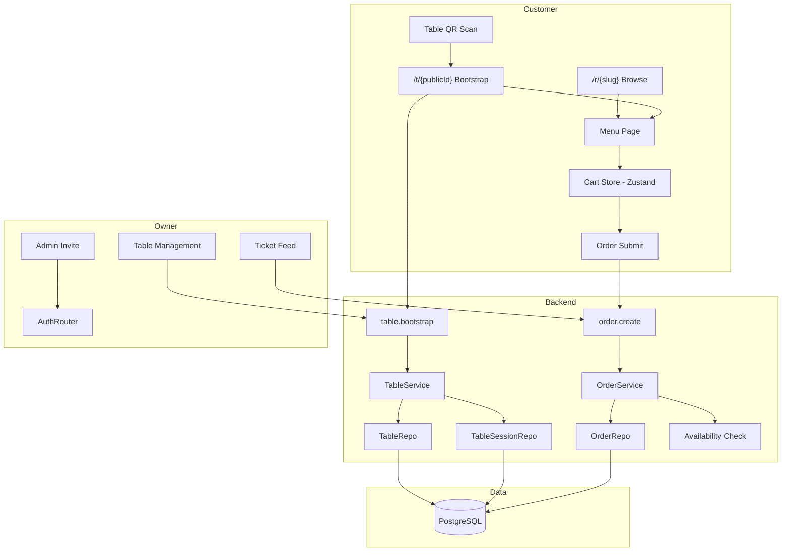
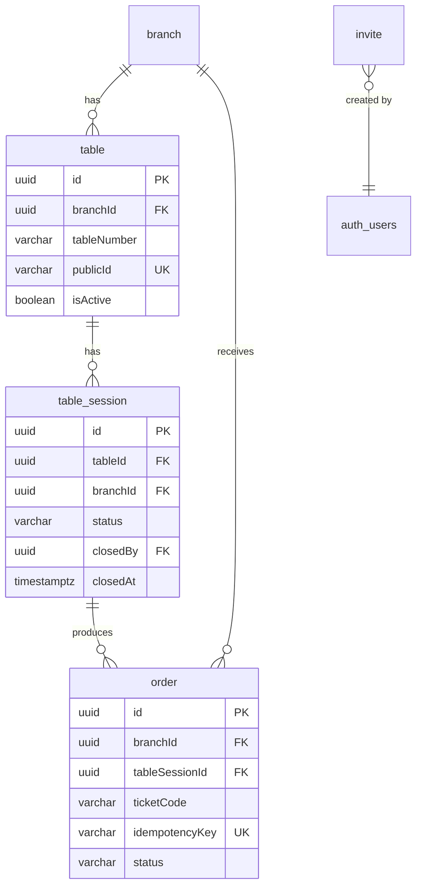

# Design — PRD v2 Track A: Table-first Dine-in MVP

> **Source PRDs:** `docs/prd-v2.md` (reconciled), `cravings-prd-v4.md` (prioritized on conflicts)
> **Plan:** `plans/prd-v2-track-a.md` (7 phases, revised per v4)
> **Date:** 2026-03-12

---

## 1. Overview

Transform CravingsPH from a menu-browsing platform into a complete dine-in ordering system. Customers scan a table QR code, browse the menu with ordering enabled, submit immutable tickets, and track status. Owners manage tables and progress tickets through a simplified lifecycle. Browse-only mode is enforced for all non-QR visitors.

**v4 reconciliation changes from original Track A plan:**

- Table sessions auto-create on QR scan (no staff-gated open/close)
- 4 order statuses: `new → preparing → ready → completed` (no "accepted" step)
- Auto-accept toggle removed from v1
- Invite-only owner onboarding (admin generates links)
- Split operating hours (multiple time ranges per day)
- Branch amenities (A/C, parking, WiFi, outdoor seating)
- Structured address fields (street, barangay added)
- Verification flow and payment setup removed from onboarding
- Deferred features: feature-flag saved/reviews/order history; hard-remove verification & payment config from UI

---

## 2. Detailed Requirements

### 2.1 Table Entity & QR

- Each branch has zero or more tables, each with a human-readable `tableNumber` (e.g., "T1", "Patio 3") and a short URL-safe `publicId` for QR codes.
- QR codes encode `/t/{publicId}` and are generated per-table in the owner portal.
- Owners can add, edit, remove, and deactivate tables under a branch.

### 2.2 Table Sessions (auto-created)

- When a customer scans a table QR, the system checks if the branch has ordering enabled and the table is active.
- If valid, a `tableSession` is auto-created (or the existing active session for that table is resumed).
- The `tableSessionId` is stored client-side (cookie or localStorage) and sent with order submissions.
- Multiple devices scanning the same table QR share the same table session and submit independent tickets against it.
- Table sessions remain active until explicitly closed by staff or automatically after a configurable inactivity timeout (future).

### 2.3 Capability Model (`menu_context`)

The backend returns a `menu_context` contract that determines client behavior:

```ts
type MenuContext = {
  mode: "browse" | "dine_in";
  canAddToCart: boolean;
  canSubmitOrder: boolean;
  tableSessionId?: string;
  tableNumber?: string;
  branchSlug?: string;
};
```

- `/r/{slug}` (restaurant page) → `mode: "browse"`, cart disabled
- `/t/{publicId}` (valid table) → `mode: "dine_in"`, cart enabled
- `/t/{publicId}` (ordering disabled or inactive table) → `mode: "browse"`, cart disabled with explanation

### 2.4 Browse-Only Mode

- Discovery, search, and direct restaurant URLs always render in browse mode.
- In browse mode: menu is fully visible, but add-to-cart, quick-add, and checkout are disabled.
- A CTA banner prompts: "Visit the restaurant and scan a table QR to order."
- Cart floating button is hidden in browse mode.

### 2.5 Dine-in Ordering

- Anonymous ordering — no login required. The `tableSessionId` is the ordering context.
- Customer customizes items (variants, modifiers), adds to cart, reviews, and submits.
- On submit, the backend validates:
  - Table session is active
  - Branch ordering is enabled
  - All items and modifiers are available
  - Idempotency key prevents duplicate submissions
- A human-readable `ticketCode` (e.g., "A-042") is generated for each ticket.
- Submitted tickets are immutable — no customer edit or cancel.
- Additional orders create new tickets under the same table session.

### 2.6 Order Status Lifecycle (v4 — 4 states)

```
new → preparing → ready → completed
```

- No "accepted" step. All tickets auto-progress from `new`.
- Owner/staff can progress tickets: `new → preparing → ready → completed`.
- Owner/staff can cancel a ticket from any state (sets status to `cancelled`).
- Each status transition is recorded in the audit trail.

### 2.7 Owner Ticket Feed

- Ticket feed shows tickets with: ticket code, table number, timestamp, line items (with variants and modifiers), special instructions.
- Tickets grouped/filtered by status tabs: New | Preparing | Ready | Completed | Cancelled.
- "Mark as Paid (Cash)" shortcut for dine-in tickets.
- Branch authorization enforced — owners only see tickets for their own branches.

### 2.8 Feature Flags & Deferred Feature Hiding

- Config-based feature flags (environment variables or shared config object).
- Flags gate UI entry points only — backend procedures remain accessible.

| Flag | Default | Controls |
|------|---------|----------|
| `ff.saved_restaurants` | `false` | Saved restaurants nav tab + heart button |
| `ff.reviews` | `false` | Reviews section + review form |
| `ff.order_history` | `false` | Order history nav tab + page |
| `ff.digital_payments` | `false` | Payment proof upload, payment config |
| `ff.order_ahead` | `false` | Pickup order type (default to dine-in) |

Additionally, **hard-remove** from onboarding UI (not flagged):
- Verification document upload and queue
- Payment method setup step

### 2.9 Dual-Mode Search

- Search UI has a **Food | Restaurant** toggle, defaulting to Restaurant.
- **Restaurant mode:** Optional name + cuisine (multi-select) + barangay (multi-select). If no barangay selected, default to current location.
- **Food mode:** Required dish query. Returns restaurant cards with matched dish names shown per restaurant.
- Case-insensitive partial matching (SQL ILIKE).
- Switching modes preserves typed query text.
- Search results route to browse-mode restaurant pages.

### 2.10 Branch Enhancements (v4)

- **Structured address:** address line, street, barangay, city/municipality, province.
- **Amenities:** Selectable icons — air conditioning, parking, free WiFi, outdoor seating.
- **Split operating hours:** Multiple time ranges per day (e.g., Monday 8AM-12PM AND 4PM-10PM).
- **Simplified settings:** Only ordering on/off toggle. Auto-accept and payment countdown removed from v1 UI.

### 2.11 Invite-Only Onboarding (v4)

- Restaurant owner accounts are not publicly self-registered.
- Admin generates an invite link → sends to restaurant owner.
- Owner opens link → creates credentials → gains access to owner portal.
- Onboarding wizard simplified: org → restaurant → branch → menu (no payment, no verification).

---

## 3. Architecture Overview

### 3.1 System Diagram



### 3.2 New Routes

| Route | Type | Purpose |
|-------|------|---------|
| `/t/[publicId]` | public | QR bootstrap → resolve table → menu with capability |
| `/organization/.../branches/[branchId]/tables` | organization | Table management page |
| `/admin/invites` | admin | Invite link generation |

### 3.3 New Module

```
src/modules/table/
├── table.router.ts
├── services/
│   ├── table.service.ts
│   └── table-session.service.ts
├── repositories/
│   ├── table.repository.ts
│   └── table-session.repository.ts
├── dtos/
│   └── table.dto.ts
├── errors/
│   └── table.errors.ts
└── factories/
    └── table.factory.ts
```

### 3.4 Modified Modules

| Module | Changes |
|--------|---------|
| `order` | Add `tableSessionId`, `ticketCode`, `idempotencyKey`. Change `order.create` from `protectedProcedure` to `publicProcedure` with table session validation. Simplify status machine to 4 states. |
| `branch` | Add `street`, `barangay`, `amenities` columns. Change operating hours to support multiple ranges per day. Remove auto-accept and payment countdown from update DTO. |
| `discovery` | Add food search procedure. Add `barangay` filter to restaurant search. |
| `auth` | Add invite link generation (admin), invite-based registration flow. |
| `menu` | No service changes. Menu page component adapts to `menu_context`. |

---

## 4. Components and Interfaces

### 4.1 Table Module — Backend

#### Router (`table.router.ts`)

```ts
// Public procedures
bootstrap(input: { publicId: string })
  → MenuContext (with device session cookie set)

// Protected procedures (owner)
list(input: { branchId: string })
  → TableDTO[]

create(input: { branchId: string, tableNumber: string })
  → TableDTO

update(input: { tableId: string, tableNumber?: string, isActive?: boolean })
  → TableDTO

remove(input: { tableId: string })
  → void

closeSession(input: { tableSessionId: string })
  → void

listSessions(input: { branchId: string, status?: string })
  → TableSessionDTO[]
```

#### Table Service

```ts
interface ITableService {
  // Public
  bootstrap(publicId: string): Promise<MenuContext>;

  // Owner
  list(userId: string, branchId: string): Promise<TableDTO[]>;
  create(userId: string, branchId: string, data: CreateTableInput): Promise<TableDTO>;
  update(userId: string, tableId: string, data: UpdateTableInput): Promise<TableDTO>;
  remove(userId: string, tableId: string): Promise<void>;
  closeSession(userId: string, tableSessionId: string): Promise<void>;
  listSessions(userId: string, branchId: string, status?: string): Promise<TableSessionDTO[]>;
}
```

**Bootstrap flow:**
1. Look up table by `publicId`
2. Check `table.isActive` and `branch.isOrderingEnabled`
3. Find or create active `tableSession` for this table
4. Return `MenuContext` with `mode: "dine_in"`, `tableSessionId`, table number

#### Table Session Service

```ts
interface ITableSessionService {
  findOrCreateForTable(tableId: string, branchId: string): Promise<TableSessionRecord>;
  close(userId: string, tableSessionId: string): Promise<void>;
  isActive(tableSessionId: string): Promise<boolean>;
}
```

### 4.2 Order Module — Modifications

#### New `order.create` (public procedure)

```ts
create: publicProcedure
  .input(CreateTicketInputSchema)
  .mutation(async ({ ctx, input }) => {
    const service = makeOrderService();
    return service.createTicket(input);
  })
```

**New input schema:**
```ts
const CreateTicketInputSchema = z.object({
  tableSessionId: z.string().uuid(),
  idempotencyKey: z.string().uuid(),
  specialInstructions: z.string().max(2000).optional(),
  items: z.array(OrderItemInputSchema).min(1),
});
```

**Service changes:**
- `createTicket(input)` replaces `create(customerId, input)`
- Validates table session is active → branch ordering enabled
- Validates item/modifier availability at submit time
- Generates `ticketCode` (e.g., "A-042")
- Checks `idempotencyKey` uniqueness (returns existing ticket on duplicate)
- Derives `branchId` from the table session (not client-supplied)
- Creates order with `status: "new"`, `orderType: "dine-in"`
- `customerId` is null (anonymous)

**Status machine changes:**
```ts
const VALID_TRANSITIONS = {
  new: ["preparing", "cancelled"],
  preparing: ["ready", "cancelled"],
  ready: ["completed", "cancelled"],
} as const;
```

Remove `accept`, `reject` procedures from router. Simplify to:
- `updateStatus(userId, orderId, status)` — staff progresses ticket
- `markPaid(userId, orderId)` — "Mark as Paid (Cash)"

### 4.3 Ticket Code Generation

Generate human-readable codes per branch using a letter prefix + sequential number:

```ts
function generateTicketCode(branchId: string, dailySequence: number): string {
  // Letter cycles A-Z based on day of month
  const letter = String.fromCharCode(65 + (new Date().getDate() % 26));
  // 3-digit zero-padded sequence
  const seq = String(dailySequence).padStart(3, "0");
  return `${letter}-${seq}`;
}
```

Daily sequence resets at midnight. Stored in DB — `SELECT MAX()` per branch per day.

### 4.4 Public ID Generation

Short, URL-safe IDs for table QR codes. Using `nanoid` with custom alphabet:

```ts
import { nanoid } from "nanoid";

function generatePublicId(): string {
  // 10 chars, URL-safe, no ambiguous chars (0/O, 1/l/I)
  return nanoid(10);
}
```

### 4.5 Frontend — Menu Context Integration

#### `/t/[publicId]/page.tsx` (new route)

Server component that:
1. Calls `table.bootstrap({ publicId })` via server caller
2. If `mode === "dine_in"`: fetches menu, renders `RestaurantMenu` with `menuContext` prop
3. If `mode === "browse"`: redirects to `/r/{slug}` or renders browse-only with explanation

#### `RestaurantMenu` modifications

Add `menuContext?: MenuContext` prop:

```tsx
interface RestaurantMenuProps {
  menu: FullMenu;
  restaurant: RestaurantDTO;
  branch: BranchDTO;
  menuContext?: MenuContext; // undefined = browse mode
}
```

When `menuContext` is undefined or `mode === "browse"`:
- Hide `CartFloatingButton`
- Disable quick-add buttons on `MenuItemCard`
- Disable "Add to cart" in `MenuItemSheet`
- Show browse-mode CTA banner at top
- Hide `CheckoutSheet` and related flows

When `menuContext.mode === "dine_in"`:
- Enable all cart interactions
- Pass `deviceSessionId` and table info to checkout flow
- `CheckoutSheet` simplified: no order type selector, no customer name/phone, just special instructions + submit

#### Cart Store — Session Binding

Cart store gains session awareness:

```ts
interface CartState {
  items: CartItem[];
  branchSlug: string | null;
  tableSessionId: string | null;  // NEW
  tableNumber: string | null;     // NEW
}
```

When `tableSessionId` is set, the cart is bound to that session. If the session changes (e.g., user scans a different table), the cart clears.

### 4.6 Checkout Flow — Simplified for Dine-in

Current `CheckoutSheet` refactored:
- Remove `OrderTypeSelector` (always dine-in when feature-flagged)
- Remove `customerName`, `customerPhone` fields
- Remove `tableNumber` manual input (auto-populated from session)
- Keep `specialInstructions` textarea
- Show order summary with table number badge
- Submit calls `order.create` with `tableSessionId` + `idempotencyKey`

### 4.7 Owner — Table Management UI

New page: `/organization/restaurants/[restaurantId]/branches/[branchId]/tables`

Components:
- `TableList` — grid/list of tables with status indicators
- `AddTableDialog` — form to add a table (tableNumber input)
- `TableCard` — shows table number, status (idle/active/inactive), QR preview, actions
- `TableQRPreview` — reuses `QRCodePreview` pattern with `/t/{publicId}` URL
- `CloseSessionButton` — closes an active table session

### 4.8 Owner — Ticket Feed (Refactored Order Management)

Modify existing `src/features/order-management/`:

**Tab changes:**
```ts
const TAB_STATUS_MAP = {
  new: ["new"],           // was "inbox: ["placed"]"
  preparing: ["preparing"],
  ready: ["ready"],
  completed: ["completed"],
  cancelled: ["cancelled"],
};
```

**Remove:** `AcceptRejectActions` component (no accept/reject flow).
**Remove:** `PaymentProofReview` component (feature-flagged).
**Add:** Table number prominently on each ticket row.
**Add:** Ticket code display (replaces order number as primary identifier).
**Keep:** `StatusUpdateDropdown` with simplified transitions.
**Keep:** `OrderTimeline` for audit trail.

### 4.9 Feature Flag System

Simple config-based approach:

```ts
// src/lib/feature-flags.ts
export const featureFlags = {
  savedRestaurants: env.FF_SAVED_RESTAURANTS === "true",
  reviews: env.FF_REVIEWS === "true",
  orderHistory: env.FF_ORDER_HISTORY === "true",
  digitalPayments: env.FF_DIGITAL_PAYMENTS === "true",
  orderAhead: env.FF_ORDER_AHEAD === "true",
} as const;

export type FeatureFlag = keyof typeof featureFlags;

export function isEnabled(flag: FeatureFlag): boolean {
  return featureFlags[flag];
}
```

Server components check directly. Client components receive flags via context or props from server parent.

### 4.10 Search — Food Mode

#### New procedure: `discovery.searchFood`

```ts
searchFood: publicProcedure
  .input(z.object({
    query: z.string().min(1).max(200),
    barangay: z.array(z.string()).optional(),
    limit: z.number().int().min(1).max(50).default(20),
  }))
  .query(...)
```

**Returns:** `FoodSearchResultDTO[]`
```ts
interface FoodSearchResultDTO {
  restaurant: RestaurantPreviewDTO;
  matchedDishes: {
    name: string;
    imageUrl: string | null;
    price: string;
  }[];
}
```

**Repository query:** JOIN restaurant → branch → category → menu_item. ILIKE on `menu_item.name`. Group by restaurant, include top matched dishes.

#### UI additions

- `SearchModeToggle` — Food | Restaurant pill toggle in search header
- URL param: `mode=food` or `mode=restaurant` (default)
- When Food mode: hide cuisine filter, show dish results per restaurant card
- `FoodSearchResultCard` — extends `RestaurantCard` with matched dishes section

### 4.11 Branch Schema Enhancements

#### Structured Address

New columns on `branch`:
- `street` varchar(200), nullable
- `barangay` varchar(100), nullable

Existing `address` field retained as the full address line.

#### Amenities

New `amenities` column on `branch` — `jsonb`, default `[]`.

```ts
type BranchAmenity = "air_conditioning" | "parking" | "free_wifi" | "outdoor_seating";
```

Stored as array of strings: `["air_conditioning", "parking"]`.

UI: Checkbox/toggle grid with icons in branch settings.

#### Split Operating Hours

Remove the unique index on `(branchId, dayOfWeek)` to allow multiple rows per day.

Add a `label` or `rangeIndex` column to distinguish ranges:

```ts
// operating_hours table changes:
// Remove: unique index on (branchId, dayOfWeek)
// Add: rangeIndex integer default 0
// New unique index: (branchId, dayOfWeek, rangeIndex)
```

UI: `WeeklyHoursEditor` gains "Add time range" button per day, with remove capability.

### 4.12 Invite-Only Onboarding

#### Admin: Invite Link Generation

New admin procedure:
```ts
admin.createInviteLink(input: { email: string, restaurantName?: string })
  → { inviteUrl: string, expiresAt: string }
```

New schema: `invite` table with `id`, `email`, `token` (unique), `expiresAt`, `usedAt`, `createdBy` (admin userId).

#### Owner: Invite-Based Registration

- `/register/owner?token={inviteToken}` route
- Validates token → pre-fills email → owner creates password
- On success: creates account, marks invite as used, redirects to onboarding wizard

#### Onboarding Wizard Simplification

Remove steps:
- Payment method setup
- Verification document upload

Keep steps:
- Create organization
- Add restaurant (name, cuisine types)
- Create branch (name, structured address, amenities, hours)
- Build menu (categories, items, variants, modifiers)

---

## 5. Data Models

### 5.1 New Tables

#### `table`

| Column | Type | Nullable | Default | Description |
|--------|------|----------|---------|-------------|
| `id` | uuid | No | `gen_random_uuid()` | PK |
| `branchId` | uuid | No | — | FK → branch (cascade) |
| `tableNumber` | varchar(50) | No | — | Display name (e.g., "T1", "Patio 3") |
| `publicId` | varchar(20) | No | — | URL-safe short ID for QR (nanoid, unique) |
| `isActive` | boolean | No | `true` | Whether table accepts orders |
| `createdAt` | timestamptz | No | `now()` | |
| `updatedAt` | timestamptz | No | `now()` | |

**Indexes:** `(branchId)`, unique on `(publicId)`, unique on `(branchId, tableNumber)`

#### `table_session`

| Column | Type | Nullable | Default | Description |
|--------|------|----------|---------|-------------|
| `id` | uuid | No | `gen_random_uuid()` | PK |
| `tableId` | uuid | No | — | FK → table (cascade) |
| `branchId` | uuid | No | — | FK → branch (denormalized) |
| `status` | varchar(20) | No | `'active'` | `'active'` or `'closed'` |
| `closedBy` | uuid | Yes | — | FK → auth.users (staff who closed) |
| `createdAt` | timestamptz | No | `now()` | Session start |
| `closedAt` | timestamptz | Yes | — | Session end |

**Indexes:** `(tableId, status)`, `(branchId, status)`

**Constraint:** Only one active session per table (enforced in service layer or partial unique index).

#### `invite`

| Column | Type | Nullable | Default | Description |
|--------|------|----------|---------|-------------|
| `id` | uuid | No | `gen_random_uuid()` | PK |
| `email` | varchar(200) | No | — | Invited email |
| `token` | varchar(100) | No | — | Unique invite token |
| `restaurantName` | varchar(200) | Yes | — | Pre-filled suggestion |
| `expiresAt` | timestamptz | No | — | Expiration |
| `usedAt` | timestamptz | Yes | — | When invite was used |
| `createdBy` | uuid | No | — | FK → auth.users (admin) |
| `createdAt` | timestamptz | No | `now()` | |

**Indexes:** unique on `(token)`, `(email)`

### 5.2 Modified Tables

#### `order` — new columns

| Column | Type | Nullable | Default | Description |
|--------|------|----------|---------|-------------|
| `tableSessionId` | uuid | Yes | — | FK → table_session (set null) |
| `ticketCode` | varchar(20) | Yes | — | Human-readable code (e.g., "A-042") |
| `idempotencyKey` | varchar(100) | Yes | — | Client-generated dedup key |

**New indexes:** unique on `(idempotencyKey)` (where not null), `(tableSessionId)`

**Status default changes:** `'placed'` → `'new'`

**Columns to deprecate (keep but stop using):** `customerName`, `customerPhone`, `paymentStatus`, `paymentMethod`, `paymentReference`, `paymentScreenshotUrl` (all nullable, safe to ignore for v1 dine-in).

#### `branch` — new columns

| Column | Type | Nullable | Default | Description |
|--------|------|----------|---------|-------------|
| `street` | varchar(200) | Yes | — | Street address |
| `barangay` | varchar(100) | Yes | — | Barangay |
| `amenities` | jsonb | No | `'[]'` | Array of amenity slugs |

#### `operating_hours` — changes

- Remove unique index on `(branchId, dayOfWeek)`
- Add `rangeIndex` integer column (default 0)
- Add unique index on `(branchId, dayOfWeek, rangeIndex)`

### 5.3 Entity Relationship Diagram



---

## 6. Error Handling

### 6.1 New Error Classes

```ts
// src/modules/table/errors/table.errors.ts

class TableNotFoundError extends NotFoundError {
  constructor(identifier: string) {
    super(`Table not found: ${identifier}`, { identifier });
  }
}

class TableSessionNotFoundError extends NotFoundError {
  constructor(sessionId: string) {
    super(`Table session not found: ${sessionId}`, { sessionId });
  }
}

class TableInactiveError extends BusinessRuleError {
  constructor(tableId: string) {
    super("This table is not currently active", { tableId });
  }
}

class SessionClosedError extends BusinessRuleError {
  constructor(tableSessionId: string) {
    super("This table session has been closed. Please scan the QR code again or ask staff for assistance.", { tableSessionId });
  }
}

class DuplicateTableNumberError extends ConflictError {
  constructor(branchId: string, tableNumber: string) {
    super(`Table "${tableNumber}" already exists in this branch`, { branchId, tableNumber });
  }
}
```

### 6.2 Modified Order Errors

```ts
class TableSessionInvalidError extends BusinessRuleError {
  constructor(tableSessionId: string) {
    super("Invalid or expired session. Please scan the table QR code again.", { tableSessionId });
  }
}

class DuplicateSubmissionError extends ConflictError {
  constructor(idempotencyKey: string, existingOrderId: string) {
    super("This order has already been submitted", { idempotencyKey, existingOrderId });
  }
  // Note: The handler should return the existing order, not throw to the client
}

class ItemUnavailableError extends BusinessRuleError {
  constructor(itemNames: string[]) {
    super(`The following items are no longer available: ${itemNames.join(", ")}`, { itemNames });
  }
}
```

### 6.3 Invite Errors

```ts
class InviteNotFoundError extends NotFoundError {
  constructor() { super("Invite not found or expired"); }
}

class InviteAlreadyUsedError extends ConflictError {
  constructor() { super("This invite has already been used"); }
}

class InviteExpiredError extends BusinessRuleError {
  constructor() { super("This invite has expired. Please request a new one."); }
}
```

---

## 7. Acceptance Criteria

### Phase 1: Table Entity + QR

```gherkin
Given an owner with a configured branch
When they create a table with number "T1"
Then the table appears in the table list with a unique publicId

Given a table exists
When the owner views the QR code preview
Then the QR encodes "/t/{publicId}" and can be downloaded as PNG

Given a branch has tables
When the owner views the table management page
Then all tables are listed with their number, status, and QR action

Given a table with number "T1" exists in a branch
When the owner tries to create another table with number "T1"
Then a DuplicateTableNumberError is returned
```

### Phase 2: Table Sessions (auto-created)

```gherkin
Given an active table with ordering enabled
When a customer scans the table QR
Then a table session is auto-created (or existing active session resumed)
And a device session is minted for the customer's browser

Given two customers scan the same table QR
When both devices complete the bootstrap
Then both receive the same tableSessionId and can submit independent tickets

Given an active table session
When staff closes the session
Then the session status becomes "closed" with timestamp
And new order submissions from that session are rejected

Given a table with an active session
When a new customer scans the QR
Then the existing session is resumed (not duplicated)
```

### Phase 3: Browse/Dine-in Mode

```gherkin
Given a customer visits /r/{slug}
When the page loads
Then menu_context.mode is "browse"
And cart actions are disabled
And a "Scan QR to order" CTA is visible

Given a customer scans a valid table QR
When the /t/{publicId} page loads
Then menu_context.mode is "dine_in"
And cart actions are enabled
And no login is required

Given a customer scans a QR for a table with ordering disabled
When the page loads
Then menu_context.mode is "browse"
And an explanation message is shown
```

### Phase 4: Immutable Ticket Submission

```gherkin
Given a customer with a valid dine-in session
When they submit an order
Then a ticket is created with a human-readable ticketCode
And the ticket status is "new"
And the customer sees a confirmation with ticket code and table number

Given a customer submits with the same idempotencyKey twice
When the second submission arrives
Then the existing ticket is returned (no duplicate created)

Given a menu item marked as sold out
When a customer tries to submit an order containing that item
Then the submission is rejected with ItemUnavailableError

Given a customer has submitted a ticket
When they want to order more items
Then a new ticket is created (previous ticket is untouched)

Given a table session has been closed
When a customer tries to submit from that session
Then the submission is rejected with SessionClosedError
```

### Phase 5: Owner Ticket Feed

```gherkin
Given tickets exist for a branch
When the owner opens the ticket feed
Then tickets are shown with ticket code, table number, items, modifiers, and timestamps

Given a ticket with status "new"
When the owner updates status to "preparing"
Then the ticket status changes and a timeline event is recorded

Given a ticket
When the owner marks it as "Paid (Cash)"
Then the payment status is updated to "confirmed"

Given a customer is viewing their ticket
When the owner updates the status
Then the customer sees the updated status
```

### Phase 6: Feature Flags

```gherkin
Given ff.saved_restaurants is false
When a customer visits the home page
Then the "Saved" nav tab is not visible
And heart buttons on restaurant cards are not visible

Given ff.reviews is false
When a customer visits a restaurant page
Then the reviews section is not rendered

Given ff.order_ahead is false
When a customer enters the checkout flow
Then the order type selector is not shown
And the order defaults to "dine-in"
```

### Phase 7: Dual-Mode Search

```gherkin
Given a customer on the search page
When they see the mode toggle
Then "Restaurant" is selected by default

Given a customer types "croiss" in Food mode
When results load
Then restaurants with items matching "croissant" are shown
And matched dish names appear under each restaurant card

Given a customer types a query in Restaurant mode
When they switch to Food mode
Then the typed query persists in the search field

Given no barangay is selected
When the customer searches
Then results default to current location proximity
```

---

## 8. Testing Strategy

### 8.1 Unit Tests (Vitest)

| Module | Test Focus | Priority |
|--------|-----------|----------|
| `TableService` | CRUD operations, publicId generation, branch scoping | High |
| `TableSessionService` | Auto-create on bootstrap, resume existing, close, active-check | High |
| `OrderService.createTicket` | Session validation, idempotency, availability check, ticket code generation | Critical |
| `OrderService` status transitions | 4-state machine validation, cancel from any state | High |
| Cart store (session binding) | Session awareness, clear on session change | Medium |
| Ticket code generation | Daily reset, letter cycling, format correctness | Medium |
| Feature flag config | Flag reading, default values | Low |
| Food search service | Partial matching, empty query rejection, result grouping | Medium |
| Invite service | Token generation, expiration, usage marking | Medium |

### 8.2 Integration Tests (Vitest)

| Flow | Test Focus |
|------|-----------|
| QR bootstrap → session → cart → submit → ticket | Full dine-in lifecycle |
| Multi-device same table | Independent tickets from shared table session |
| Closed session rejection | Submit after session close |
| Idempotency | Duplicate key returns existing ticket |
| Availability check | Submit with sold-out item |

### 8.3 E2E Tests (Playwright)

| Scenario | Coverage |
|----------|----------|
| Browse-only mode | Visit `/r/{slug}`, verify cart disabled, CTA visible |
| Dine-in order flow | Visit `/t/{publicId}` → browse → customize → cart → submit → confirmation |
| Owner table management | Create table, view QR, close session |
| Owner ticket feed | View tickets, progress status, mark paid |
| Feature flag hiding | Verify saved/reviews/order history hidden |
| Dual-mode search | Toggle Food/Restaurant, search, verify results |

### 8.4 Test Infrastructure

- Service-level tests mock only the repository layer
- Tests in `src/__tests/` mirroring the source tree
- `restoreMocks: true`, `clearMocks: true`
- Idempotency key generated via `crypto.randomUUID()` in tests

---

## 9. Appendices

### A. Technology Choices

| Decision | Choice | Rationale |
|----------|--------|-----------|
| Public ID generation | `nanoid` (10 chars) | URL-safe, no ambiguous chars, collision-resistant at this scale |
| Feature flags | Environment variables | Simplest approach for v1; no flag service overhead |
| QR code library | `qrcode` (npm) | Already in use for branch QR |
| Operating hours | Multiple rows per day | Simpler than jsonb; supports SQL queries directly |

### B. Research Findings Summary

1. **Order module** is fully built with 11 tRPC procedures, status machine, audit trail. All procedures use `protectedProcedure` — `create` must change to `publicProcedure`.
2. **Cart store** is client-only Zustand with smart merging. No backend changes needed — session binding is a client concern.
3. **QR generation** uses `qrcode` npm at branch level. Same component reusable for per-table QR with different URL.
4. **Discovery search** only queries restaurant name/cuisine. Food mode needs a new procedure joining menu items.
5. **~18 UI entry points** across 5 features need gating. All are UI-only gates.
6. **DB uses UUID PKs, varchar enums, no pgEnum.** No short-code utilities exist — need `nanoid` for `publicId` and ticket code generator.
7. **Auth is Supabase-based** with 3 procedure types. Table session IDs are passed client-side for anonymous ordering — no per-device tracking needed.

### C. Alternative Approaches Considered

| Decision | Alternative | Why Rejected |
|----------|------------|--------------|
| Staff-gated sessions (v2) | Auto-create sessions (v4) | v4 prioritized — simpler UX, less staff overhead |
| 5-state order lifecycle (v2) | 4-state lifecycle (v4) | v4 prioritized — "accepted" step adds friction without value for dine-in |
| pgEnum for statuses | varchar columns | Existing codebase convention is varchar; avoids migration friction for enum changes |
| Feature flag service | Environment variables | Over-engineered for 5 boolean flags in v1 |
| Per-device tracking (v2 deviceSession) | Shared table session only | Unnecessary complexity — carts are client-local, tickets are already independent, table session ID is sufficient |

### D. Migration Considerations

**Order of migrations:**
1. Add `table`, `table_session`, `invite` tables
2. Add new columns to `order` (nullable, safe for existing rows)
3. Add new columns to `branch` (nullable/default, safe for existing rows)
4. Modify `operating_hours` index (drop unique, add rangeIndex, add new unique)
5. Change `order.status` default from `'placed'` to `'new'`

All migrations are additive — no destructive changes to existing data.

**Data migration:** Existing orders retain `status: 'placed'`/`'accepted'`. The new status machine only applies to orders created after migration. UI should handle both old and new statuses gracefully during transition.
