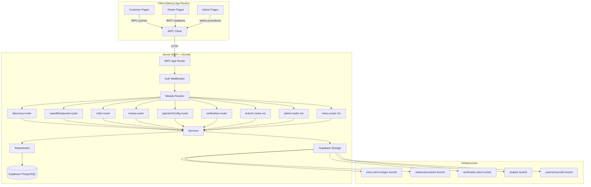
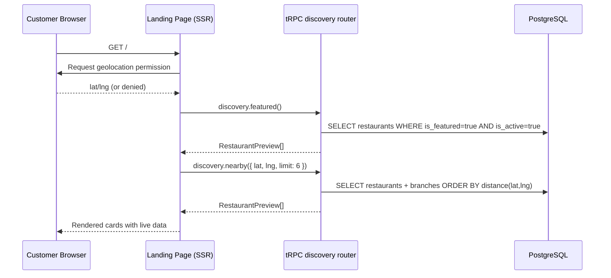
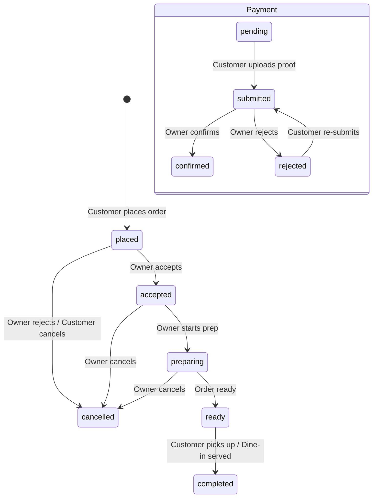

# UI Audit Resolution — Detailed Design

## Overview

Resolve all 18 issues from the initial UI audit to make CravingsPH production-ready. The core problem: the scaffold was built with seed data and local stores as visual stand-ins. This design replaces all stub/local state with real backend integration, enforces portal separation, adds file upload infrastructure, and fixes component-level bugs.

**Scope:** 8 new database tables, 2 column additions, 6 new tRPC routers, extensions to 3 existing routers, 8 frontend hook rewrites, 3 page stub replacements, Supabase Storage infrastructure, QR scanner, and component fixes.

---

## Detailed Requirements

### R1: Full Backend Integration
All authenticated flows must use real Supabase-backed data. No local stores, no seed data, no localStorage persistence for business data. Empty states shown for new accounts/organizations with no data.

### R2: Portal Separation
Add `portal_preference` enum column to profile table. Customer registration sets `customer`, owner registration sets `owner`. Owner layout, organization mutations, and onboarding routes enforce `portal_preference = 'owner'`. Customers redirected to `/` if they attempt owner routes.

### R3: Geolocation-Aware Discovery
Add lat/lng to branch table. Browser geolocation for proximity sorting. `restaurant.is_featured` (already exists) for editorial curation. Branch-derived location filters (dynamic city/province from published branches).

### R4: Browser QR Scanner
Replace placeholder CTA with `html5-qrcode` camera scanner. QR codes encode restaurant/branch slugs. Scanner decodes and navigates to `/restaurant/{slug}`.

### R5: Rich Order Model
Full order lifecycle: placed → accepted → preparing → ready → completed/cancelled. Order status history for audit trail. Payment status tracking. Review/rating system tied to real orders.

### R6: Configuration-Only Payment Methods
Persist owner-configured payment methods per organization (type, account details). No payment gateway processing. Empty state for new orgs.

### R7: Real File Uploads via Supabase Storage
Verification documents uploaded to private bucket. Menu item images uploaded to public bucket. Seed script for storage buckets following next16bp pattern. Remove arbitrary URL input for images.

### R8: Cebu City Seed Data
3-4 additional restaurant fixtures in `scripts/seed-data/` focused on Cebu City. Update seed runner to iterate over multiple fixtures. Include lat/lng coordinates for geolocation testing.

### R9: Component Fixes
- Breadcrumb: fix nested `<li>` hydration errors
- Add item dialog: preselect category, fix optional imageUrl validation
- Onboarding wizard: don't declare complete while required steps remain
- Owner nav: remove or create missing routes

---

## Architecture Overview



### Data Flow: Discovery



### Data Flow: Order Lifecycle



### Data Flow: Portal Separation

```mermaid
flowchart TD
    A[User registers] --> B{Registration type?}
    B -->|Customer form| C[profile.portal_preference = 'customer']
    B -->|Owner form| D[profile.portal_preference = 'owner']

    E[User logs in] --> F[Post-login page]
    F --> G{portal_preference?}
    G -->|owner| H[Check org existence]
    H -->|has org| I[/organization dashboard]
    H -->|no org| J[/organization/get-started]
    G -->|customer| K[/ homepage]
    G -->|admin role| L[/admin]
    G -->|null/legacy| M{Has org?}
    M -->|yes| I
    M -->|no| K

    N[Owner layout guard] --> O{portal_preference = 'owner'?}
    O -->|yes| P[Render owner shell]
    O -->|no| Q[Redirect to /]
```

---

## Components and Interfaces

### New tRPC Routers

#### discovery.router.ts
```typescript
discovery.featured()        // publicProcedure → RestaurantPreview[]
discovery.nearby({ lat?, lng?, limit? })  // publicProcedure → RestaurantPreview[]
discovery.search({ query?, cuisine?, city?, province? })  // publicProcedure → RestaurantPreview[]
discovery.locations()       // publicProcedure → { city, province, count }[]
```

#### savedRestaurant.router.ts
```typescript
savedRestaurant.list()                    // protectedProcedure → SavedRestaurantRecord[]
savedRestaurant.save({ restaurantId })    // protectedProcedure → void
savedRestaurant.unsave({ restaurantId })  // protectedProcedure → void
savedRestaurant.isSaved({ restaurantId }) // protectedProcedure → boolean
```

#### order.router.ts
```typescript
// Customer procedures
order.create({ branchId, items, orderType, ... })  // protectedProcedure → Order
order.listMine()                                     // protectedProcedure → CustomerOrderRecord[]
order.getDetail({ orderId })                         // protectedProcedure → Order + items

// Owner procedures
order.listByBranch({ branchId, status? })           // protectedProcedure → OrderRecord[]
order.accept({ orderId })                            // protectedProcedure → void
order.reject({ orderId, reason? })                   // protectedProcedure → void
order.updateStatus({ orderId, status })              // protectedProcedure → void
order.confirmPayment({ orderId })                    // protectedProcedure → void
order.rejectPayment({ orderId, reason? })            // protectedProcedure → void
order.getTimeline({ orderId })                       // protectedProcedure → OrderStatusEvent[]
order.reorder({ orderId })                           // protectedProcedure → { items, branchId }
```

#### review.router.ts
```typescript
review.create({ orderId, rating, comment })          // protectedProcedure → Review
review.listByRestaurant({ restaurantSlug, limit? })  // publicProcedure → Review[]
```

#### paymentConfig.router.ts
```typescript
paymentConfig.list()                                  // protectedProcedure → PaymentMethodConfig[]
paymentConfig.add({ type, accountName, ... })         // protectedProcedure → PaymentMethodConfig
paymentConfig.update({ id, ... })                     // protectedProcedure → PaymentMethodConfig
paymentConfig.remove({ id })                          // protectedProcedure → void
paymentConfig.setDefault({ id })                      // protectedProcedure → void
paymentConfig.has()                                   // protectedProcedure → boolean
```

#### verification.router.ts
```typescript
verification.getRestaurantStatus({ restaurantId })    // protectedProcedure → VerificationState
verification.uploadDocument({ restaurantId, type, fileName, fileUrl })  // protectedProcedure → void
verification.removeDocument({ restaurantId, type })   // protectedProcedure → void
verification.submit({ restaurantId })                 // protectedProcedure → void
verification.isSubmitted({ restaurantId })            // protectedProcedure → boolean
```

#### Existing Router Extensions

**branch.router.ts** additions:
```typescript
branch.getOperatingHours({ branchId })                // protectedProcedure → OperatingHour[]
branch.updateOperatingHours({ branchId, hours[] })    // protectedProcedure → void
```

**admin.router.ts** additions:
```typescript
admin.setUserActive({ userId, isActive })             // adminProcedure → void
```

**menu.router.ts** additions:
```typescript
menu.hasContent({ branchId })                         // protectedProcedure → boolean
```

### Frontend Hook Replacements

Each local hook gets rewritten to use tRPC queries and mutations. The public interface stays the same where possible to minimize component changes.

**Pattern:**
```typescript
export function useSavedRestaurants() {
  const trpc = useTRPC();
  const { data: restaurants = [], isLoading } = useQuery(
    trpc.savedRestaurant.list.queryOptions()
  );
  const saveMutation = useMutation(trpc.savedRestaurant.save.mutationOptions());
  const unsaveMutation = useMutation(trpc.savedRestaurant.unsave.mutationOptions());

  return {
    restaurants,
    isLoading,
    saveRestaurant: (restaurantId: string) => saveMutation.mutate({ restaurantId }),
    unsaveRestaurant: (restaurantId: string) => unsaveMutation.mutate({ restaurantId }),
    isSaved: (restaurantId: string) => restaurants.some(r => r.restaurantId === restaurantId),
  };
}
```

### New UI Components

#### QR Scanner Modal
- Uses `html5-qrcode` for camera access
- Modal triggered from landing page CTA
- Decodes QR → extracts slug → navigates to `/restaurant/{slug}`
- Camera permission handling with user-friendly messaging
- Close button to dismiss

#### Save Button on Discovery Cards
- Heart/bookmark icon on restaurant cards
- Authenticated: toggles save state via tRPC mutation
- Guest: redirects to `/login?redirect={currentPath}`
- Optimistic UI update

#### Image Upload Component
- Replaces URL text input in add-item dialog
- File picker with drag-and-drop
- Uploads to Supabase Storage `menu-item-images` bucket
- Returns public URL for menu_item.image_url
- Preview thumbnail after upload
- Size/type validation (max 5MB, image/* only)

---

## Data Models

### New Drizzle Schema Files

#### saved_restaurant.ts
```typescript
export const savedRestaurant = pgTable("saved_restaurant", {
  id: uuid("id").primaryKey().defaultRandom(),
  userId: uuid("user_id").notNull().references(() => authUsers.id, { onDelete: "cascade" }),
  restaurantId: uuid("restaurant_id").notNull().references(() => restaurant.id, { onDelete: "cascade" }),
  savedAt: timestamp("saved_at", { withTimezone: true }).notNull().defaultNow(),
  note: text("note"),
  createdAt: timestamp("created_at", { withTimezone: true }).notNull().defaultNow(),
  updatedAt: timestamp("updated_at", { withTimezone: true }).notNull().defaultNow(),
}, (t) => [
  uniqueIndex("idx_saved_restaurant_user_restaurant").on(t.userId, t.restaurantId),
  index("idx_saved_restaurant_user").on(t.userId),
]);
```

#### order.ts
```typescript
export const order = pgTable("order", {
  id: uuid("id").primaryKey().defaultRandom(),
  orderNumber: varchar("order_number", { length: 20 }).notNull().unique(),
  branchId: uuid("branch_id").notNull().references(() => branch.id, { onDelete: "cascade" }),
  customerId: uuid("customer_id").references(() => authUsers.id, { onDelete: "set null" }),
  orderType: varchar("order_type", { length: 20 }).notNull(), // 'dine-in' | 'pickup'
  customerName: varchar("customer_name", { length: 200 }),
  customerPhone: varchar("customer_phone", { length: 20 }),
  tableNumber: varchar("table_number", { length: 20 }),
  totalAmount: numeric("total_amount", { precision: 10, scale: 2 }).notNull(),
  status: varchar("status", { length: 20 }).notNull().default("placed"),
  paymentStatus: varchar("payment_status", { length: 20 }).notNull().default("pending"),
  paymentMethod: varchar("payment_method", { length: 50 }),
  paymentReference: varchar("payment_reference", { length: 200 }),
  paymentScreenshotUrl: text("payment_screenshot_url"),
  specialInstructions: text("special_instructions"),
  createdAt: timestamp("created_at", { withTimezone: true }).notNull().defaultNow(),
  updatedAt: timestamp("updated_at", { withTimezone: true }).notNull().defaultNow(),
}, (t) => [
  index("idx_order_branch_status").on(t.branchId, t.status),
  index("idx_order_customer").on(t.customerId),
  index("idx_order_created").on(t.createdAt),
]);
```

#### order_item.ts
```typescript
export const orderItem = pgTable("order_item", {
  id: uuid("id").primaryKey().defaultRandom(),
  orderId: uuid("order_id").notNull().references(() => order.id, { onDelete: "cascade" }),
  menuItemId: uuid("menu_item_id").references(() => menuItem.id, { onDelete: "set null" }),
  itemVariantId: uuid("item_variant_id").references(() => itemVariant.id, { onDelete: "set null" }),
  name: varchar("name", { length: 200 }).notNull(),
  quantity: integer("quantity").notNull().default(1),
  unitPrice: numeric("unit_price", { precision: 10, scale: 2 }).notNull(),
  modifiers: jsonb("modifiers"), // [{ name, price }]
  createdAt: timestamp("created_at", { withTimezone: true }).notNull().defaultNow(),
  updatedAt: timestamp("updated_at", { withTimezone: true }).notNull().defaultNow(),
}, (t) => [
  index("idx_order_item_order").on(t.orderId),
]);
```

#### order_status_history.ts
```typescript
export const orderStatusHistory = pgTable("order_status_history", {
  id: uuid("id").primaryKey().defaultRandom(),
  orderId: uuid("order_id").notNull().references(() => order.id, { onDelete: "cascade" }),
  fromStatus: varchar("from_status", { length: 20 }),
  toStatus: varchar("to_status", { length: 20 }).notNull(),
  changedBy: uuid("changed_by").references(() => authUsers.id, { onDelete: "set null" }),
  note: text("note"),
  createdAt: timestamp("created_at", { withTimezone: true }).notNull().defaultNow(),
}, (t) => [
  index("idx_order_status_history_order").on(t.orderId),
]);
```

#### review.ts
```typescript
export const review = pgTable("review", {
  id: uuid("id").primaryKey().defaultRandom(),
  orderId: uuid("order_id").notNull().references(() => order.id, { onDelete: "cascade" }),
  restaurantId: uuid("restaurant_id").notNull().references(() => restaurant.id, { onDelete: "cascade" }),
  userId: uuid("user_id").notNull().references(() => authUsers.id, { onDelete: "cascade" }),
  authorName: varchar("author_name", { length: 200 }),
  rating: integer("rating").notNull(), // 1-5
  comment: text("comment"),
  createdAt: timestamp("created_at", { withTimezone: true }).notNull().defaultNow(),
  updatedAt: timestamp("updated_at", { withTimezone: true }).notNull().defaultNow(),
}, (t) => [
  index("idx_review_restaurant").on(t.restaurantId),
  index("idx_review_user").on(t.userId),
  uniqueIndex("idx_review_order").on(t.orderId), // one review per order
]);
```

#### payment_method.ts
```typescript
export const paymentMethod = pgTable("payment_method", {
  id: uuid("id").primaryKey().defaultRandom(),
  organizationId: uuid("organization_id").notNull().references(() => organization.id, { onDelete: "cascade" }),
  type: varchar("type", { length: 20 }).notNull(), // 'gcash' | 'maya' | 'bank'
  accountName: varchar("account_name", { length: 200 }).notNull(),
  accountNumber: varchar("account_number", { length: 100 }).notNull(),
  bankName: varchar("bank_name", { length: 200 }),
  isDefault: boolean("is_default").notNull().default(false),
  isActive: boolean("is_active").notNull().default(true),
  createdAt: timestamp("created_at", { withTimezone: true }).notNull().defaultNow(),
  updatedAt: timestamp("updated_at", { withTimezone: true }).notNull().defaultNow(),
}, (t) => [
  index("idx_payment_method_org").on(t.organizationId),
]);
```

#### verification_document.ts
```typescript
export const verificationDocument = pgTable("verification_document", {
  id: uuid("id").primaryKey().defaultRandom(),
  restaurantId: uuid("restaurant_id").notNull().references(() => restaurant.id, { onDelete: "cascade" }),
  documentType: varchar("document_type", { length: 50 }).notNull(), // 'business_registration' | 'valid_government_id' | 'business_permit'
  fileName: varchar("file_name", { length: 500 }),
  fileUrl: text("file_url"),
  uploadedAt: timestamp("uploaded_at", { withTimezone: true }),
  status: varchar("status", { length: 20 }).notNull().default("pending"),
  rejectionReason: text("rejection_reason"),
  createdAt: timestamp("created_at", { withTimezone: true }).notNull().defaultNow(),
  updatedAt: timestamp("updated_at", { withTimezone: true }).notNull().defaultNow(),
}, (t) => [
  index("idx_verification_document_restaurant").on(t.restaurantId),
  uniqueIndex("idx_verification_document_type").on(t.restaurantId, t.documentType),
]);
```

#### operating_hours.ts
```typescript
export const operatingHours = pgTable("operating_hours", {
  id: uuid("id").primaryKey().defaultRandom(),
  branchId: uuid("branch_id").notNull().references(() => branch.id, { onDelete: "cascade" }),
  dayOfWeek: integer("day_of_week").notNull(), // 0=Monday ... 6=Sunday
  opensAt: time("opens_at").notNull(),
  closesAt: time("closes_at").notNull(),
  isClosed: boolean("is_closed").notNull().default(false),
  createdAt: timestamp("created_at", { withTimezone: true }).notNull().defaultNow(),
  updatedAt: timestamp("updated_at", { withTimezone: true }).notNull().defaultNow(),
}, (t) => [
  uniqueIndex("idx_operating_hours_branch_day").on(t.branchId, t.dayOfWeek),
]);
```

### Column Additions to Existing Tables

#### profile table
```typescript
portalPreference: varchar("portal_preference", { length: 20 }), // 'customer' | 'owner'
```

#### branch table
```typescript
latitude: numeric("latitude", { precision: 10, scale: 7 }),
longitude: numeric("longitude", { precision: 10, scale: 7 }),
```

---

## Error Handling

### Discovery Errors
- No restaurants found → show empty state with "No restaurants in your area yet"
- Geolocation denied → fall back to showing all restaurants without proximity sort
- Restaurant slug not found → 404 page (already handled)

### Order Errors
- Branch not accepting orders → show "This branch is not accepting orders right now"
- Menu item unavailable during order → remove from cart, notify customer
- Order status transition invalid → reject with explanation (e.g., can't go from "placed" to "ready")
- Payment proof upload failure → retry with user-friendly message

### Portal Separation Errors
- Customer navigating to /organization/* → redirect to / silently
- Legacy account (null portal_preference) with org → treat as owner (backward compatible)
- Legacy account without org → treat as customer

### File Upload Errors
- File too large (>5MB) → client-side validation before upload attempt
- Invalid file type → client-side validation
- Storage upload failure → retry button, preserve form state
- Hostname not in next.config → eliminated by using Supabase Storage only

### Breadcrumb / Hydration
- After fix, verify zero hydration errors on all owner pages via Playwright console capture

---

## Acceptance Criteria

### AC-001: Discovery shows live data
```
Given a published restaurant exists in the database
When a customer visits /
Then the restaurant appears in the featured or nearby section
And clicking the card navigates to a working /restaurant/{slug} page
```

### AC-002: Search filters by location
```
Given restaurants exist in "Cebu City" and "Mandaue"
When a customer selects "Cebu City" from the location filter on /search
Then only restaurants with branches in Cebu City are shown
```

### AC-003: QR scanner works
```
Given a valid QR code encoding a restaurant slug
When a customer taps "Scan cravings QR" and scans the code
Then the scanner decodes the slug and navigates to /restaurant/{slug}
```

### AC-004: Save-for-later on discovery
```
Given an authenticated customer on /
When they tap the save button on a restaurant card
Then the restaurant is saved to their account
And the save state persists across sessions and devices
```

### AC-005: Saved restaurants are account-scoped
```
Given a new customer account with no saved restaurants
When they visit /saved
Then the page shows the empty state
And no seed data is present
```

### AC-006: Order history is account-scoped
```
Given a new customer account with no orders
When they visit /orders
Then the page shows the empty state with zero orders and zero spend
```

### AC-007: Reorder validates target
```
Given a customer with a completed order for a valid restaurant
When they tap "Reorder"
Then items are added to cart and they navigate to the working restaurant page
```

### AC-008: Portal separation enforced
```
Given a customer account (portal_preference = 'customer')
When they navigate to /organization/get-started
Then they are redirected to /
And they cannot call organization.create via tRPC
```

### AC-009: Owner nav has no dead links
```
Given an owner in the dashboard
When they click any sidebar link
Then the route exists and renders correctly (no 404)
```

### AC-010: Onboarding completion is honest
```
Given an owner who completed steps 1-3 but skipped 4-6
When they view /organization/get-started
Then the hub shows 3 of 7 complete
And the wizard does NOT show "You're All Set!"
```

### AC-011: Branch orders are branch-scoped
```
Given a new branch with no orders
When the owner views that branch's orders page
Then the page shows the empty state
```

### AC-012: Payment methods are org-scoped
```
Given a new organization with no configured payment methods
When the owner visits /organization/payments
Then the page shows the empty state with zero methods
```

### AC-013: Verification starts in draft
```
Given a newly created restaurant
When the owner visits /organization/verify
Then the restaurant shows "Draft" status with 0 of 3 documents
```

### AC-014: Operating hours persist
```
Given an owner sets Monday hours to 9:00-21:00 for a branch
When they refresh the page
Then Monday hours still show 9:00-21:00
```

### AC-015: Breadcrumb hydration clean
```
Given any owner page with breadcrumbs
When the page loads
Then zero hydration errors appear in the console
```

### AC-016: Admin user toggle persists
```
Given an admin deactivates a user
When they refresh the admin user list
Then the user still shows as deactivated
```

### AC-017: Add item dialog works on first try
```
Given a branch with one category "Meals"
When the owner opens the Add Item dialog
Then "Meals" is pre-selected as the category
And leaving Image empty does not trigger a validation error
And filling name + price + submitting creates the item
```

### AC-018: No image URL crashes
```
Given menu items are created with Supabase Storage uploads only
When a customer views the restaurant page
Then all images load from Supabase and no hostname errors occur
```

---

## Testing Strategy

### Unit Tests
- Order status transition logic (valid/invalid transitions)
- Portal preference enforcement in middleware
- Discovery query building (geolocation sort, featured filter)
- Payment method validation (bank requires bankName)
- Operating hours validation (opens_at < closes_at, no overlapping)

### Integration Tests (tRPC)
- Each new router: happy path for all procedures
- Authorization: customer cannot call owner procedures
- Authorization: owner cannot call admin procedures
- Order lifecycle: create → accept → preparing → ready → completed
- Cascading deletes: deleting restaurant removes verification docs

### E2E Tests (Playwright)
- **Customer flow:** Visit / → click restaurant → view menu → add to cart → place order
- **Discovery flow:** / → search → filter by city → filter by cuisine → results update
- **QR flow:** / → scan QR → lands on restaurant page
- **Save flow:** / → save restaurant → visit /saved → restaurant appears
- **Owner flow:** Login → dashboard → no dead links → create menu item (no crash)
- **Onboarding flow:** Owner register → wizard → skip steps → hub shows correct progress
- **Portal separation:** Customer login → navigate to /organization/* → redirected
- **Breadcrumb:** Visit owner pages → zero console hydration errors

### Verification Checklist
Each issue (001-018) gets a dedicated Playwright test that reproduces the original bug and verifies the fix. Tests run against `http://localhost:3000/` with the seeded Cebu City data.

---

## Appendices

### A. Technology Choices

| Component | Choice | Rationale |
|-----------|--------|-----------|
| QR Scanner | html5-qrcode | Lightweight, browser-only, no native deps |
| File Upload | Supabase Storage JS SDK | Already installed, integrated with auth |
| Geolocation | Browser Geolocation API + SQL distance | No external service, Haversine in SQL |
| Location Filter | Branch-derived dynamic | Zero maintenance, reflects real coverage |
| Image Handling | Supabase Storage only | Eliminates hostname crashes, controlled source |
| Order Numbers | Sequential with prefix | e.g., "ORD-1001", auto-incrementing |

### B. Research Findings Summary

- 10 existing DB tables are well-structured with consistent patterns
- 8 tRPC routers follow clean module conventions (factory DI, transactions)
- `restaurant.is_featured` already exists — no schema change needed for featured
- `branch.city/province` already indexed together — location filter has DB support
- Supabase client installed but zero upload infrastructure exists
- All 8 local hooks use `useSyncExternalStore` pattern — consistent replacement approach
- Owner layout has no role enforcement — only session + org check

### C. Alternative Approaches Considered

1. **Hybrid scaffolding (Option B/C):** Rejected — user chose full backend integration
2. **Entitlement-based portal (Option B):** Rejected — role-based via profile.portal_preference chosen
3. **Manual QR code entry:** Rejected — browser camera scanner chosen
4. **Payment gateway integration:** Deferred — config-only for now
5. **Predefined location regions:** Rejected — branch-derived dynamic filter chosen
6. **Minimal order model:** Rejected — rich model with status history and reviews chosen

### D. Seed Data Plan

Create 3-4 Cebu City restaurant fixtures:
1. **Lechon House** — Cebu lechon specialist, Cebu City (lat: 10.3157, lng: 123.8854)
2. **Sugbo Mercado Grill** — grilled seafood and Filipino street food, Mandaue (lat: 10.3236, lng: 123.9223)
3. **Cafe Cebuano** — coffee and pastries, IT Park Cebu City (lat: 10.3303, lng: 123.9058)
4. **Pochero de Cebu** — traditional Cebuano pochero and soup, Talisay (lat: 10.2447, lng: 123.8494)

Each fixture includes 4-6 categories with 3-5 items per category, variants, and modifier groups. All branches have lat/lng for geolocation testing.

### E. Storage Bucket Configuration

| Bucket | Visibility | Max File Size | Allowed Types |
|--------|-----------|---------------|---------------|
| menu-item-images | public | 5MB | image/jpeg, image/png, image/webp |
| restaurant-assets | public | 5MB | image/jpeg, image/png, image/webp |
| verification-docs | private | 10MB | application/pdf, image/jpeg, image/png |
| avatars | public | 2MB | image/jpeg, image/png, image/webp |
| payment-proofs | private | 5MB | image/jpeg, image/png, application/pdf |
